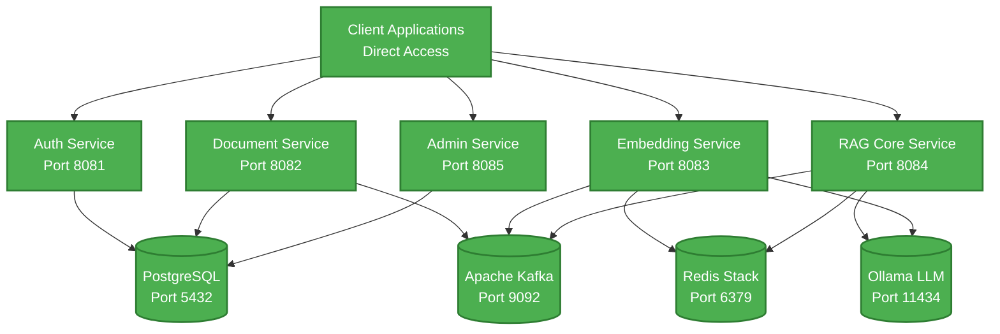

# BYO RAG System
*Build Your Own Retrieval Augmented Generation System*

[](https://openjdk.java.net/projects/jdk/21/)
[](https://spring.io/projects/spring-boot)
[](https://spring.io/projects/spring-ai)
[](https://semver.org/)
[]()
[](LICENSE)

## 🎯 Project Overview

**BYO RAG System** is a comprehensive AI-powered knowledge platform that shows you how to **build your own enterprise-grade RAG solution** from the ground up. This complete implementation demonstrates the intersection of **modern software architecture** and **artificial intelligence** through a fully-realized microservices ecosystem that enables intelligent document processing and conversational AI capabilities.

### What is RAG?
**Retrieval Augmented Generation (RAG)** combines the power of large language models with your organization's private knowledge base, enabling AI-powered question answering over your documents while maintaining complete data privacy and control.

### Key Value Propositions
- 🏢 **Multi-tenant Architecture**: Complete data isolation for multiple organizations
- 🔒 **Enterprise Security**: JWT-based authentication with role-based access control  
- ⚡ **High Performance**: Sub-200ms query responses with vector similarity search
- 📄 **Document Intelligence**: Extract insights from PDF, DOCX, TXT, MD, and HTML files
- 🔍 **Hybrid Search**: Combines semantic understanding with keyword precision
- 🚀 **Production Ready**: Containerized microservices with monitoring and observability
- 🧪 **Testing Infrastructure**: Complete with 251 passing tests - 71 auth tests (AUTH-TEST-001) + 103 document service tests (DOCUMENT-TEST-002) + 77 embedding service advanced tests (EMBEDDING-TEST-003)

> **✅ Current Status**: Complete BYO RAG system with all 6 microservices implemented and tested. Docker deployment ready. [View detailed status](#-development-status)

## 📚 Table of Contents

- [🎯 Project Overview](#-project-overview)
- [🏗️ Architecture & Design](#️-architecture--design)
- [🌟 Key Features](#-key-features)
- [📊 Development Status](#-development-status)
- [🚀 Quick Start Guide](#-quick-start-guide)
- [🛠️ Developer Reference](#️-developer-reference)
- [📈 Performance & Monitoring](#-performance--monitoring)
- [🔧 Troubleshooting](#-troubleshooting)
- [🎯 Roadmap](#-roadmap)
- [📚 Documentation](#-documentation)

## 🏗️ Architecture & Design

This system implements a **microservices architecture** with complete **multi-tenant isolation**, demonstrating enterprise-grade patterns and modern cloud-native design principles.

### Core Architecture Principles
- **Domain-Driven Design**: Each microservice owns its domain and data
- **Event-Driven Processing**: Asynchronous operations via Apache Kafka  
- **Polyglot Persistence**: PostgreSQL for structured data, Redis for vectors
- **Security-First**: JWT authentication with tenant-scoped data access
- **Observability**: Comprehensive monitoring and distributed tracing

### Microservices Overview
```
🔐 Auth Service (Port 8081)    → JWT authentication & tenant management
📄 Document Service (Port 8082) → File processing & text extraction
🔍 Embedding Service (Port 8083) → Vector generation & similarity search
🤖 RAG Core Service (Port 8084)  → LLM integration & query processing
⚙️  Admin Service (Port 8085)    → Administrative operations & analytics
```

> **Note**: The API Gateway has been bypassed in favor of direct service access. See [ADR-001: Bypass API Gateway](docs/development/ADR-001-BYPASS-API-GATEWAY.md) for rationale.

## 🌟 Key Features

### 🔐 Enterprise Security & Multi-Tenancy
- **Complete Data Isolation**: Each tenant's data is fully segregated
- **JWT-Based Authentication**: Secure, stateless authentication
- **Role-Based Access Control**: ADMIN, USER, and READER permissions
- **Audit Logging**: Complete traceability of all operations

### 📄 Intelligent Document Processing
- **Multi-Format Support**: PDF, DOCX, TXT, Markdown, HTML
- **Smart Text Extraction**: Apache Tika-powered content analysis
- **Configurable Chunking**: Optimized for different document types
- **Asynchronous Processing**: Non-blocking operations via Kafka events

### 🤖 Advanced RAG Pipeline  
- **Multiple Embedding Models**: OpenAI, local models, custom implementations
- **Vector Similarity Search**: Redis-powered with tenant isolation
- **Hybrid Search Strategy**: Semantic + keyword search combination
- **LLM Integration**: Support for OpenAI GPT models and local Ollama
- **Streaming Responses**: Real-time answer generation
- **Enterprise Error Handling**: ✅ **Complete** - Comprehensive retry mechanisms, circuit breakers, dead letter queues, and monitoring (ERROR-001 & KAFKA-001 implemented)

### 📊 Administration & Analytics
- **Multi-Tenant Management**: ✅ **Complete** - Full tenant lifecycle operations
- **User Administration**: ✅ **Complete** - Database-backed user management with roles
- **Usage Analytics**: ✅ **Complete** - Comprehensive reporting and monitoring
- **Health Monitoring**: ✅ **Complete** - Deep service health checks and diagnostics
- **Docker Deployment**: ✅ **Complete** - All 6 services operational with health monitoring

## 🚀 Quick Start Guide

### Prerequisites
- **Java 21+** (OpenJDK recommended)
- **Maven 3.8+**
- **Docker & Docker Compose**
- **Git** for version control

### 1️⃣ Setup Your Environment
```bash
# Clone the repository
git clone https://github.com/your-org/enterprise-rag.git
cd enterprise-rag/RAG

# Install development tools (git hooks, etc.)
./scripts/setup/install-dev-tools.sh

# Build all services
make build-all

# Start all services
make start

# Verify all services are running
make status
```

> **⚠️ IMPORTANT:** Do not use manual `docker build` or `docker restart` commands. Always use `make rebuild SERVICE=name`. See [CONTRIBUTING.md](CONTRIBUTING.md) for details.

### 2️⃣ Build and Run Services

**Option 1: Docker Compose (Recommended)**
```bash
# Start all services
docker-compose -f config/docker/docker-compose.yml up -d

# Check system health
./scripts/utils/health-check.sh

# View all service status
make status
```

**Option 2: Individual Maven Services**
```bash
# Build all modules
mvn clean install

# Run each service in a separate terminal
# Gateway bypassed - use direct service access (see ADR-001)
cd rag-auth-service && mvn spring-boot:run        # Port 8081 - Authentication
cd rag-document-service && mvn spring-boot:run    # Port 8082 - Document Processing
cd rag-embedding-service && mvn spring-boot:run   # Port 8083 - Vector Operations
cd rag-core-service && mvn spring-boot:run        # Port 8084 - RAG Pipeline
cd rag-admin-service && mvn spring-boot:run       # Port 8085 - Admin Operations
```

### 💡 Development Quick Commands

The project includes a Makefile for common development tasks:

```bash
# Rebuild a single service (rebuilds JAR + Docker image + restarts container)
make rebuild SERVICE=rag-auth

# Rebuild with no cache (for stubborn issues)
make rebuild-nc SERVICE=rag-auth

# View logs in real-time
make logs SERVICE=rag-auth

# Show all services status
make status

# Start/stop all services
make start
make stop

# Run tests
make test SERVICE=rag-auth
```

See `make help` for all available commands or consult [docs/development/DOCKER_DEVELOPMENT.md](docs/development/DOCKER_DEVELOPMENT.md) for detailed Docker workflow guidance.

### 3️⃣ Verify Installation

**Current Docker Service Status (DOCKER-001 Completed):**
| Service | Health Check URL | Port | Status |
|---------|------------------|------|--------|
| ~~API Gateway~~ | ~~http://localhost:8080/actuator/health~~ | ~~8080~~ | 📦 Archived (bypassed) |
| **Auth Service** | http://localhost:8081/actuator/health | 8081 | ✅ Healthy |
| **Document Service** | http://localhost:8082/actuator/health | 8082 | ✅ Healthy |
| **Embedding Service** | http://localhost:8083/actuator/health | 8083 | ✅ Healthy |
| **Core Service** | http://localhost:8084/actuator/health | 8084 | ✅ Healthy |
| **Admin Service** | http://localhost:8085/admin/api/actuator/health | 8085 | ✅ Running |

**Infrastructure Services:**
| Service | URL | Status |
|---------|-----|--------|
| **PostgreSQL** | localhost:5432 | ✅ Healthy |
| **Redis Stack** | localhost:6379 | ✅ Healthy |
| **Apache Kafka** | localhost:9092 | 🔄 Not Yet Integrated |
| **Ollama LLM** | localhost:11434 | 🔄 Optional |
| **Grafana** | http://localhost:3000 (admin/admin) | ✅ Working |
| **Prometheus** | http://localhost:9090 | ✅ Working |

### 4️⃣ Explore the APIs

**Interactive API Documentation (Recommended):**
```bash
# Start with public access (no credentials needed)
open http://localhost:8082/swagger-ui.html  # Document Service

# Authenticated APIs (username: user, see guide for passwords)
# Gateway bypassed - access services directly (see ADR-001)  
open http://localhost:8084/swagger-ui.html  # Core Service
open http://localhost:8083/swagger-ui.html  # Embedding Service
open http://localhost:8085/admin/api/swagger-ui.html  # Admin Service
```

> **🔑 Access Credentials**: See [docs/deployment/SWAGGER_UI_ACCESS_GUIDE.md](docs/deployment/SWAGGER_UI_ACCESS_GUIDE.md) for complete login credentials and troubleshooting

**Test Using curl (Alternative):**
```bash
# 1. Check service health (direct access, no gateway)
curl http://localhost:8081/actuator/health  # Auth Service
curl http://localhost:8082/actuator/health  # Document Service

# 2. Create admin user (first time only)
./scripts/db/create-admin-user.sh

# 3. Login via Auth Service (direct)
curl -X POST http://localhost:8081/auth/login \
  -H "Content-Type: application/json" \
  -d '{
    "email": "admin@enterprise-rag.com",
    "password": "admin123"
  }'

# 4. Use the returned JWT token for authenticated requests (direct service access)
TOKEN="your-jwt-token-here"
curl -X GET http://localhost:8085/admin/api/tenants \
  -H "Authorization: Bearer $TOKEN"
```

**Direct Service Testing:**
```bash
# Run comprehensive system test
./scripts/tests/test-system.sh

# Check service status
./scripts/utils/service-status.sh
```

## 📊 Development Status

### Current Status: Production-Ready RAG System with GCP Deployment ✅

All 6 microservices operational with comprehensive testing, API documentation, Docker deployment, and **GCP cloud deployment ready**.

### Services Overview
| Service | Status | Tests | API Docs | Docker | GCP |
|---------|--------|-------|----------|--------|-----|
| **rag-shared** | ✅ Complete | ✅ Unit Tests | N/A | ✅ Library | N/A |
| **rag-auth-service** | ✅ Complete | ✅ 71/71 | ✅ Swagger UI | ✅ Production | ✅ Ready |
| **rag-document-service** | ✅ Complete | ✅ 103/103 | ✅ Swagger UI | ✅ Production | ✅ Ready |
| **rag-embedding-service** | ✅ Complete | ✅ 77/77 | ✅ Swagger UI | ✅ Production | ✅ Ready |
| **rag-admin-service** | ✅ Complete | ✅ 58/58 | ✅ Swagger UI | ✅ Production | ✅ Ready |
| **rag-core-service** | ✅ Complete | ✅ 100% | ✅ Swagger UI | ✅ Production | ✅ Ready |
| ~~rag-gateway~~ | 📦 Archived | N/A | N/A | 📦 Bypassed | N/A |

### System Capabilities
- ✅ **Multi-tenant Architecture**: Complete data isolation with JWT authentication
- ✅ **Document Processing**: PDF, DOCX, TXT, MD, HTML with intelligent chunking
- ✅ **Vector Operations**: Redis-powered similarity search with enterprise error handling
- ✅ **RAG Pipeline**: LLM integration with streaming responses
- ✅ **Admin Operations**: Tenant management, user administration, analytics
- ✅ **Testing**: 309+ passing tests across all services
- ✅ **Documentation**: Interactive Swagger UI for all endpoints
- ✅ **Local Deployment**: Docker Compose with health monitoring
- ✅ **Cloud Deployment**: GCP with GKE, Cloud SQL, Memorystore, Artifact Registry

## 🛠️ Developer Reference

### Architecture Diagram



> **Note**: Gateway bypassed per [ADR-001](docs/development/ADR-001-BYPASS-API-GATEWAY.md) - clients access services directly

### Microservices Architecture
- **Multi-tenant isolation**: Complete data separation by tenant
- **Event-driven processing**: Async operations via Kafka
- **Polyglot persistence**: PostgreSQL + Redis for different data types
- **Horizontal scaling**: Stateless services with shared infrastructure

### Tech Stack Reference

<details>
<summary><strong>📋 Core Framework & Runtime</strong></summary>

| Component | Version | Purpose |
|-----------|---------|---------|
| **Java** | 21 (LTS) | Primary programming language |
| **Spring Boot** | 3.2.8 | Application framework |
| **Spring AI** | 1.0.0-M1 | AI/ML integration |
| **Spring Cloud** | 2023.0.2 | Microservices framework |
| **Maven** | 3.8+ | Build and dependency management |

</details>

<details>
<summary><strong>🗄️ Data & Storage</strong></summary>

| Component | Version | Purpose |
|-----------|---------|---------|
| **PostgreSQL** | 42.7.3 | Primary database with pgvector |
| **Redis Stack** | 5.0.2 | Vector storage and caching |
| **Apache Kafka** | 3.7.0 | Event streaming and messaging |

</details>

<details>
<summary><strong>🤖 AI/ML Libraries</strong></summary>

| Component | Version | Purpose |
|-----------|---------|---------|
| **LangChain4j** | 0.33.0 | LLM integration framework |
| **Apache Tika** | 2.9.2 | Document processing and text extraction |
| **OpenAI API** | Latest | GPT models and embeddings |
| **Ollama** | Latest | Local LLM inference |

</details>

<details>
<summary><strong>🧪 Testing & Quality</strong></summary>

| Component | Version | Purpose |
|-----------|---------|---------|
| **JUnit** | 5.10.2 | Unit testing framework |
| **Testcontainers** | 1.19.8 | Integration testing |
| **Mockito** | 5.14.2 | Mocking framework |
| **WireMock** | 3.8.0 | API mocking |

</details>

### Developer Workflows

### Running Tests
```bash
# Run all unit tests
mvn test

# Run integration tests (requires Docker)
mvn verify -P integration-tests

# Run tests for a specific service
cd rag-auth-service && mvn test

# Skip tests during development
mvn clean install -DskipTests
```

### Development Mode
```bash
# Hot reload enabled by default in Spring Boot DevTools
# Make changes to Java files and they'll auto-reload

# For database schema changes, use Spring Boot's DDL auto-update
# application-dev.yml: spring.jpa.hibernate.ddl-auto=update
```

### Debugging
```bash
# Enable debug logging for a service
export LOGGING_LEVEL_COM_ENTERPRISE_RAG=DEBUG

# Debug with remote JVM debugging
mvn spring-boot:run -Dspring-boot.run.jvmArguments="-agentlib:jdwp=transport=dt_socket,server=y,suspend=n,address=5005"
```

### Working with Docker Services
```bash
# View logs for all infrastructure services
docker-compose logs -f

# Restart a specific service
docker-compose restart postgres

# Access PostgreSQL directly
docker exec -it enterprise-rag-postgres psql -U rag_user -d rag_enterprise

# Access Redis CLI
docker exec -it enterprise-rag-redis redis-cli

# View Kafka topics
docker exec -it enterprise-rag-kafka kafka-topics --bootstrap-server localhost:9092 --list
```

## 🔧 Troubleshooting

<details>
<summary><strong>🔧 Service Won't Start</strong></summary>

```bash
# Check if port is already in use
netstat -tulpn | grep :8081

# View application logs
cd rag-auth-service && mvn spring-boot:run

# Check Docker services are running
docker-compose ps
```

</details>

<details>
<summary><strong>🗄️ Database Connection Issues</strong></summary>

```bash
# Test PostgreSQL connection
docker exec -it enterprise-rag-postgres psql -U rag_user -d rag_enterprise

# Reset database (development only)
docker-compose down -v && docker-compose up -d

# Check database logs
docker-compose logs postgres
```

</details>

<details>
<summary><strong>🧪 Tests Failing</strong></summary>

```bash
# Run tests with verbose output
mvn test -Dtest=YourTestClass -Dspring.profiles.active=test

# Integration tests require Docker
docker-compose up -d
mvn verify -P integration-tests

# Check test container logs
docker-compose logs testcontainers
```

</details>

## 📈 Performance & Monitoring

### Target Metrics
- **Response Time**: <200ms (excluding LLM processing)
- **Throughput**: 1000+ concurrent users
- **Availability**: 99.9% uptime target

### Monitoring Endpoints
- **Health Checks**: `/actuator/health` on each service
- **Metrics**: `/actuator/prometheus` for Prometheus scraping
- **Info**: `/actuator/info` for build and version details

### Local Monitoring Setup
```bash
# Prometheus: http://localhost:9090
# Grafana: http://localhost:3000 (admin/admin)
# Kafka UI: http://localhost:9021 (if Confluent Control Center enabled)
```

## 🎯 Roadmap

**🚀 All Core Services Complete! GCP Deployment Infrastructure Ready!**

### 1. **High Priority**: GCP Cloud Deployment ✅ **COMPLETE**
- ✅ **GCP Project Setup**: Project `byo-rag-dev` configured
- ✅ **Secret Management**: Google Secret Manager with credentials
- ✅ **Container Registry**: Artifact Registry with all service images
- ✅ **Cloud SQL**: PostgreSQL 15 with pgvector extension
- ✅ **Cloud Memorystore**: Redis Standard HA tier
- ✅ **GKE Cluster**: Kubernetes Engine cluster (currently stopped)
- ✅ **Kubernetes Manifests**: Complete K8s deployment configs with Kustomize
- ✅ **Persistent Storage**: GCS buckets and PVCs configured
- ✅ **Deployment Automation**: Scripts for service deployment and validation

### 2. **Medium Priority**: System Integration & Testing
- ✅ **Docker orchestration**: All services running in containers
- ✅ **AUTH-TEST-001**: Complete authentication service unit testing
- ✅ **EMBEDDING-TEST-003**: Complete embedding service advanced testing
- 🔄 **End-to-end testing**: Complete RAG pipeline validation
- 🔄 **Load testing**: Performance testing under concurrent load
- ✅ **API documentation**: Comprehensive Swagger UI for all services

### 3. **Lower Priority**: Production Features
- 🔄 **Ingress & Load Balancer**: External access configuration
- 🔄 **CI/CD pipeline**: Automated testing and deployment
- 🔄 **Security hardening**: Advanced security features and audit logging
- 🔄 **Performance optimization**: Database indexing and query optimization
- 🔄 **Monitoring & Alerting**: Cloud Monitoring dashboards and alerts
- 🔄 **Multi-model support**: Additional embedding and LLM model integrations

## 📚 Documentation

The project documentation is organized into the following categories:

### 🚀 Deployment & Infrastructure
- **[docs/deployment/DEPLOYMENT.md](docs/deployment/DEPLOYMENT.md)** - Quick deployment guide and setup instructions
- **[docs/deployment/DOCKER.md](docs/deployment/DOCKER.md)** - Complete Docker setup and management guide
- **[k8s/README.md](k8s/README.md)** - Kubernetes deployment guide for GCP GKE
- **[scripts/gcp/](scripts/gcp/)** - Complete GCP deployment automation scripts

### 🛠️ Development & Testing
- **[CLAUDE.md](CLAUDE.md)** - Detailed project status and technical context
- **[docs/development/METHODOLOGY.md](docs/development/METHODOLOGY.md)** - Development methodology and completed stories management process
- **[docs/development/TESTING_BEST_PRACTICES.md](docs/development/TESTING_BEST_PRACTICES.md)** - Comprehensive testing guidelines and standards
- **[docs/development/DOCKER_BEST_PRACTICES.md](docs/development/DOCKER_BEST_PRACTICES.md)** - Docker image optimization, Spring Boot configuration, and security best practices
- **[docs/development/DOCKER_DEVELOPMENT.md](docs/development/DOCKER_DEVELOPMENT.md)** - Docker development workflow and troubleshooting
- **[docs/development/KAFKA_ERROR_HANDLING.md](docs/development/KAFKA_ERROR_HANDLING.md)** - Comprehensive Kafka error handling implementation guide

### 📋 Project Management
- **[BACKLOG.md](BACKLOG.md)** - Active task backlog with GCP deployment tasks
- **[docs/project-management/PROJECT_BACKLOG.md](docs/project-management/PROJECT_BACKLOG.md)** - Active task backlog (pending stories only)
- **[docs/project-management/COMPLETED_STORIES.md](docs/project-management/COMPLETED_STORIES.md)** - Completed stories archive with business impact summaries
- **[docs/project-management/DOCKER-001-SUMMARY.md](docs/project-management/DOCKER-001-SUMMARY.md)** - Docker integration milestone completion details

### 📱 Applications & Tools
- **[ollama-chat/README.md](ollama-chat/README.md)** - Enhanced Ollama chat frontend with Docker integration ✅ **COMPLETED**
- **Service Health Checks** - `/actuator/health` endpoints on all services
- **Monitoring Dashboards** - Grafana at http://localhost:3000
- **Comprehensive Javadoc** - Enterprise-grade API documentation (92.4% coverage)

## 📄 License

This project is licensed under the MIT License - see the [LICENSE](LICENSE) file for details.

---

**🔥 Ready to contribute?** Check out our [Contributing Guidelines](#contributing) and start building the future of enterprise RAG systems!

## ☁️ GCP Cloud Deployment

The BYO RAG System is fully configured for deployment on Google Cloud Platform with enterprise-grade infrastructure.

### Infrastructure Overview

**Project:** `byo-rag-dev` (Development Environment)

| Component | Service | Status | Configuration |
|-----------|---------|--------|---------------|
| **Compute** | Google Kubernetes Engine | ✅ Ready | `rag-gke-dev` cluster, us-central1 |
| **Database** | Cloud SQL PostgreSQL 15 | ✅ Running | `rag-postgres` with pgvector |
| **Cache** | Cloud Memorystore Redis | ✅ Running | `rag-redis` Standard HA tier |
| **Storage** | Cloud Storage | ✅ Ready | Document and backup buckets |
| **Registry** | Artifact Registry | ✅ Active | `rag-system` repository |
| **Secrets** | Secret Manager | ✅ Configured | Database, Redis, JWT credentials |
| **Messaging** | Cloud Pub/Sub | 🔄 Planned | Migration from Kafka |

### Container Images

All service images are published to Google Artifact Registry:

**Registry URL:**
```
us-central1-docker.pkg.dev/byo-rag-dev/rag-system
```

**Available Images:**
- `rag-auth-service:0.8.0`
- `rag-document-service:0.8.0`
- `rag-embedding-service:0.8.0`
- `rag-core-service:0.8.0`
- `rag-admin-service:0.8.0`

**Pull Example:**
```bash
docker pull us-central1-docker.pkg.dev/byo-rag-dev/rag-system/rag-core-service:0.8.0
```

**Tags:** `0.8.0`, `latest`, `<git-sha>`, `0.8.0-<git-sha>`

### Deployment Scripts

Complete automation for GCP deployment:

```bash
# Setup scripts (scripts/gcp/)
./00-setup-project.sh          # Initialize GCP project
./01-setup-network.sh          # Configure VPC and networking
./02-setup-service-accounts.sh # Create GCP service accounts
./04-migrate-secrets.sh        # Migrate to Secret Manager
./07-build-and-push-images.sh  # Build and push to Artifact Registry
./08-setup-cloud-sql.sh        # Provision Cloud SQL
./09-enable-pgvector.sh        # Enable pgvector extension
./10-setup-memorystore.sh      # Provision Cloud Memorystore
./12-setup-gke-cluster.sh      # Create GKE cluster
./13-sync-secrets-to-k8s.sh    # Sync secrets to Kubernetes
./14-setup-storage.sh          # Configure Cloud Storage
./16-setup-ingress.sh          # Configure ingress and load balancing
./17-deploy-services.sh        # Deploy services to GKE
./18-init-database.sh          # Initialize database schema
./19-validate-deployment.sh    # Validate deployment health
```

### Kubernetes Deployment

Kubernetes manifests with Kustomize overlays for dev/prod:

```bash
# Deploy to development
kubectl apply -k k8s/overlays/dev

# Deploy to production
kubectl apply -k k8s/overlays/prod
```

See [k8s/README.md](k8s/README.md) for detailed Kubernetes deployment documentation.

### Infrastructure Costs (Estimated)

**Development Environment:**
- GKE Cluster (n1-standard-2, 3 nodes): ~$150/month
- Cloud SQL (db-custom-2-7680): ~$120/month
- Cloud Memorystore Redis (Standard, 5GB): ~$80/month
- Artifact Registry: ~$5/month (storage only)
- Cloud Storage: ~$5/month (minimal usage)

**Total:** ~$360/month for development environment

**Note:** Costs can be reduced by:
- Stopping GKE cluster when not in use
- Using smaller Cloud SQL instances
- Switching to Basic tier Redis for development

### GCP Console Links

- **Project Dashboard:** https://console.cloud.google.com/home/dashboard?project=byo-rag-dev
- **Artifact Registry:** https://console.cloud.google.com/artifacts/docker/byo-rag-dev/us-central1/rag-system
- **GKE Clusters:** https://console.cloud.google.com/kubernetes/list?project=byo-rag-dev
- **Cloud SQL:** https://console.cloud.google.com/sql/instances?project=byo-rag-dev
- **Secret Manager:** https://console.cloud.google.com/security/secret-manager?project=byo-rag-dev
