# Enterprise RAG System

[](https://openjdk.java.net/projects/jdk/21/)
[](https://spring.io/projects/spring-boot)
[](https://spring.io/projects/spring-ai)
[](https://semver.org/)
[](LICENSE)

> **🚧 Beta Status (0.8.0)**: Core functionality implemented. Missing API Gateway service. See [Development Status](#development-status) for details.

An enterprise-grade RAG (Retrieval Augmented Generation) system built with Spring Boot 3.x, demonstrating advanced backend engineering and modern AI integration.

## 📚 Table of Contents

- [🚀 Quick Start for Developers](#-quick-start-for-developers)
  - [Prerequisites](#prerequisites)
  - [1️⃣ Setup Your Environment](#1️⃣-setup-your-environment)
  - [2️⃣ Build and Run Services](#2️⃣-build-and-run-services)
  - [3️⃣ Verify Installation](#3️⃣-verify-installation)
  - [4️⃣ Test the System](#4️⃣-test-the-system)
- [📊 Development Status](#-development-status)
- [🏗️ Architecture Overview](#️-architecture-overview)
- [🛠️ Tech Stack Reference](#️-tech-stack-reference)
- [🧰 Developer Workflows](#-developer-workflows)
  - [Running Tests](#running-tests)
  - [Development Mode](#development-mode)
  - [Debugging](#debugging)
  - [Working with Docker Services](#working-with-docker-services)
- [🌟 Key Features Implemented](#-key-features-implemented)
- [🚨 Common Development Issues](#-common-development-issues)
- [📈 Performance & Monitoring](#-performance--monitoring)
- [🎯 Next Development Priorities](#-next-development-priorities)
- [📚 Additional Documentation](#-additional-documentation)

## 🚀 Quick Start for Developers

### Prerequisites
- **Java 21+** (OpenJDK recommended)
- **Maven 3.8+**
- **Docker & Docker Compose**
- **Git** for version control

### 1️⃣ Setup Your Environment
```bash
# Clone the repository
git clone https://github.com/your-org/enterprise-rag.git
cd enterprise-rag

# Start infrastructure services (PostgreSQL, Redis, Kafka, Ollama)
docker-compose up -d

# Verify all services are running
docker-compose ps
```

### 2️⃣ Build and Run Services
```bash
# Build all modules
mvn clean install

# Run each service in a separate terminal
cd rag-auth-service && mvn spring-boot:run         # Port 8081
cd rag-document-service && mvn spring-boot:run     # Port 8083  
cd rag-embedding-service && mvn spring-boot:run    # Port 8084
cd rag-core-service && mvn spring-boot:run         # Port 8082
cd rag-admin-service && mvn spring-boot:run        # Port 8085
# Note: rag-gateway (Port 8080) - NOT YET IMPLEMENTED
```

### 3️⃣ Verify Installation
| Service | Health Check URL | Swagger UI |
|---------|------------------|------------|
| **Auth Service** | http://localhost:8081/actuator/health | http://localhost:8081/swagger-ui.html |
| **Document Service** | http://localhost:8083/actuator/health | http://localhost:8083/swagger-ui.html |
| **Core Service** | http://localhost:8082/actuator/health | http://localhost:8082/swagger-ui.html |
| **Admin Service** | http://localhost:8085/actuator/health | http://localhost:8085/swagger-ui.html |

### 4️⃣ Test the System
```bash
# 1. Create a tenant
curl -X POST http://localhost:8081/api/v1/tenants/register \
  -H "Content-Type: application/json" \
  -d '{
    "name": "Dev Company",
    "slug": "dev-company", 
    "description": "Development tenant"
  }'

# 2. Create admin user (use tenant ID from step 1)
curl -X POST http://localhost:8081/api/v1/users \
  -H "Content-Type: application/json" \
  -d '{
    "firstName": "Dev",
    "lastName": "Admin",
    "email": "dev@company.com", 
    "password": "DevPass123!",
    "role": "ADMIN",
    "tenantId": "YOUR_TENANT_ID"
  }'

# 3. Login and get JWT token
curl -X POST http://localhost:8081/api/v1/auth/login \
  -H "Content-Type: application/json" \
  -d '{
    "email": "dev@company.com",
    "password": "DevPass123!"
  }'
```

## 📊 Development Status

### ✅ Implemented Services (5/6)
| Service | Status | Completeness | Key Features |
|---------|--------|--------------|--------------|
| **rag-shared** | ✅ Complete | 90% | Common DTOs, entities, utilities |
| **rag-auth-service** | ✅ Complete | 85% | JWT auth, tenant management |
| **rag-document-service** | ✅ Complete | 75% | File processing, chunking |
| **rag-embedding-service** | ✅ Complete | 75% | Vector operations, embeddings |
| **rag-core-service** | ✅ Complete | 70% | RAG pipeline, LLM integration |
| **rag-admin-service** | ✅ Complete | 90% | Admin operations, analytics |

### ❌ Missing Critical Component
| Service | Status | Impact | Priority |
|---------|--------|--------|----------|
| **rag-gateway** | ❌ Not Implemented | High - No API gateway | **HIGHEST** |

### 🔧 Known Issues
- **Integration tests**: Some stability issues with external dependencies
- **Error handling**: Needs enhancement for production robustness
- **Monitoring**: Basic metrics implemented, needs comprehensive dashboards

## 🏗️ Architecture Overview

```mermaid
graph TB
    Gateway[API Gateway<br/>Port 8080<br/>❌ NOT IMPLEMENTED]
    Auth[Auth Service<br/>Port 8081<br/>✅ READY]
    Doc[Document Service<br/>Port 8083<br/>✅ READY] 
    Embed[Embedding Service<br/>Port 8084<br/>✅ READY]
    Core[RAG Core Service<br/>Port 8082<br/>✅ READY]
    Admin[Admin Service<br/>Port 8085<br/>✅ READY]
    
    PG[(PostgreSQL<br/>Port 5432)]
    Redis[(Redis Stack<br/>Port 6379)]
    Kafka[(Apache Kafka<br/>Port 9092)]
    
    Gateway --> Auth
    Gateway --> Doc
    Gateway --> Core
    Gateway --> Admin
    
    Auth --> PG
    Doc --> PG
    Embed --> Redis
    Core --> Redis
    Admin --> PG
    
    Doc --> Kafka
    Embed --> Kafka
    Core --> Kafka
```



### Microservices Architecture
- **Multi-tenant isolation**: Complete data separation by tenant
- **Event-driven processing**: Async operations via Kafka
- **Polyglot persistence**: PostgreSQL + Redis for different data types
- **Horizontal scaling**: Stateless services with shared infrastructure

## 🛠️ Tech Stack Reference

<details>
<summary><strong>📋 Core Framework & Runtime</strong></summary>

| Component | Version | Purpose |
|-----------|---------|---------|
| **Java** | 21 (LTS) | Primary programming language |
| **Spring Boot** | 3.2.8 | Application framework |
| **Spring AI** | 1.0.0-M1 | AI/ML integration |
| **Spring Cloud** | 2023.0.2 | Microservices framework |
| **Maven** | 3.8+ | Build and dependency management |

</details>

<details>
<summary><strong>🗄️ Data & Storage</strong></summary>

| Component | Version | Purpose |
|-----------|---------|---------|
| **PostgreSQL** | 42.7.3 | Primary database with pgvector |
| **Redis Stack** | 5.0.2 | Vector storage and caching |
| **Apache Kafka** | 3.7.0 | Event streaming and messaging |

</details>

<details>
<summary><strong>🤖 AI/ML Libraries</strong></summary>

| Component | Version | Purpose |
|-----------|---------|---------|
| **LangChain4j** | 0.33.0 | LLM integration framework |
| **Apache Tika** | 2.9.2 | Document processing and text extraction |
| **OpenAI API** | Latest | GPT models and embeddings |
| **Ollama** | Latest | Local LLM inference |

</details>

<details>
<summary><strong>🧪 Testing & Quality</strong></summary>

| Component | Version | Purpose |
|-----------|---------|---------|
| **JUnit** | 5.10.2 | Unit testing framework |
| **Testcontainers** | 1.19.8 | Integration testing |
| **Mockito** | 5.14.2 | Mocking framework |
| **WireMock** | 3.8.0 | API mocking |

</details>

## 🧰 Developer Workflows

### Running Tests
```bash
# Run all unit tests
mvn test

# Run integration tests (requires Docker)
mvn verify -P integration-tests

# Run tests for a specific service
cd rag-auth-service && mvn test

# Skip tests during development
mvn clean install -DskipTests
```

### Development Mode
```bash
# Hot reload enabled by default in Spring Boot DevTools
# Make changes to Java files and they'll auto-reload

# For database schema changes, use Spring Boot's DDL auto-update
# application-dev.yml: spring.jpa.hibernate.ddl-auto=update
```

### Debugging
```bash
# Enable debug logging for a service
export LOGGING_LEVEL_COM_ENTERPRISE_RAG=DEBUG

# Debug with remote JVM debugging
mvn spring-boot:run -Dspring-boot.run.jvmArguments="-agentlib:jdwp=transport=dt_socket,server=y,suspend=n,address=5005"
```

### Working with Docker Services
```bash
# View logs for all infrastructure services
docker-compose logs -f

# Restart a specific service
docker-compose restart postgres

# Access PostgreSQL directly
docker exec -it enterprise-rag-postgres psql -U rag_user -d rag_enterprise

# Access Redis CLI
docker exec -it enterprise-rag-redis redis-cli

# View Kafka topics
docker exec -it enterprise-rag-kafka kafka-topics --bootstrap-server localhost:9092 --list
```

## 🌟 Key Features Implemented

### 🔐 Multi-Tenant Authentication
- JWT-based authentication with tenant scoping
- Role-based access control (ADMIN, USER, READER)
- Complete data isolation between tenants
- Password hashing with BCrypt

### 📄 Document Processing Pipeline
- Support for PDF, DOCX, TXT, MD, HTML formats
- Intelligent text extraction using Apache Tika
- Configurable chunking strategies
- Async processing with Kafka events

### 🔍 Vector Search & RAG
- Multiple embedding models (OpenAI, local models)
- Redis-based vector storage with tenant isolation
- Hybrid search (semantic + keyword)
- Sub-200ms query response times

### 📊 Admin Operations
- Complete tenant management
- User administration with database persistence
- Analytics and reporting endpoints
- 100% test coverage achieved

## 🚨 Common Development Issues

<details>
<summary><strong>🔧 Service Won't Start</strong></summary>

```bash
# Check if port is already in use
netstat -tulpn | grep :8081

# View application logs
cd rag-auth-service && mvn spring-boot:run

# Check Docker services are running
docker-compose ps
```

</details>

<details>
<summary><strong>🗄️ Database Connection Issues</strong></summary>

```bash
# Test PostgreSQL connection
docker exec -it enterprise-rag-postgres psql -U rag_user -d rag_enterprise

# Reset database (development only)
docker-compose down -v && docker-compose up -d

# Check database logs
docker-compose logs postgres
```

</details>

<details>
<summary><strong>🧪 Tests Failing</strong></summary>

```bash
# Run tests with verbose output
mvn test -Dtest=YourTestClass -Dspring.profiles.active=test

# Integration tests require Docker
docker-compose up -d
mvn verify -P integration-tests

# Check test container logs
docker-compose logs testcontainers
```

</details>

## 📈 Performance & Monitoring

### Target Metrics
- **Response Time**: <200ms (excluding LLM processing)
- **Throughput**: 1000+ concurrent users
- **Availability**: 99.9% uptime target

### Monitoring Endpoints
- **Health Checks**: `/actuator/health` on each service
- **Metrics**: `/actuator/prometheus` for Prometheus scraping
- **Info**: `/actuator/info` for build and version details

### Local Monitoring Setup
```bash
# Prometheus: http://localhost:9090
# Grafana: http://localhost:3000 (admin/admin)
# Kafka UI: http://localhost:8080
```

## 🎯 Next Development Priorities

### 1. **Critical**: Implement rag-gateway
- Spring Cloud Gateway configuration
- Request routing to all microservices
- JWT token validation at gateway level
- Rate limiting and load balancing

### 2. **High**: Stabilize Integration Tests
- Fix external dependency issues
- Improve test data management
- Add comprehensive error scenarios

### 3. **Medium**: Enhance Production Readiness
- Comprehensive error handling
- Performance optimization
- Security hardening
- Monitoring dashboards

## 📚 Additional Documentation

- **[DEPLOYMENT.md](DEPLOYMENT.md)** - Production deployment guide
- **[CLAUDE.md](CLAUDE.md)** - Detailed project status and technical context
- **Swagger UI** - Live API documentation at service endpoints

## 📄 License

This project is licensed under the MIT License - see the [LICENSE](LICENSE) file for details.

---

**🔥 Ready to contribute?** Check out our [Contributing Guidelines](#contributing) and start building the future of enterprise RAG systems!