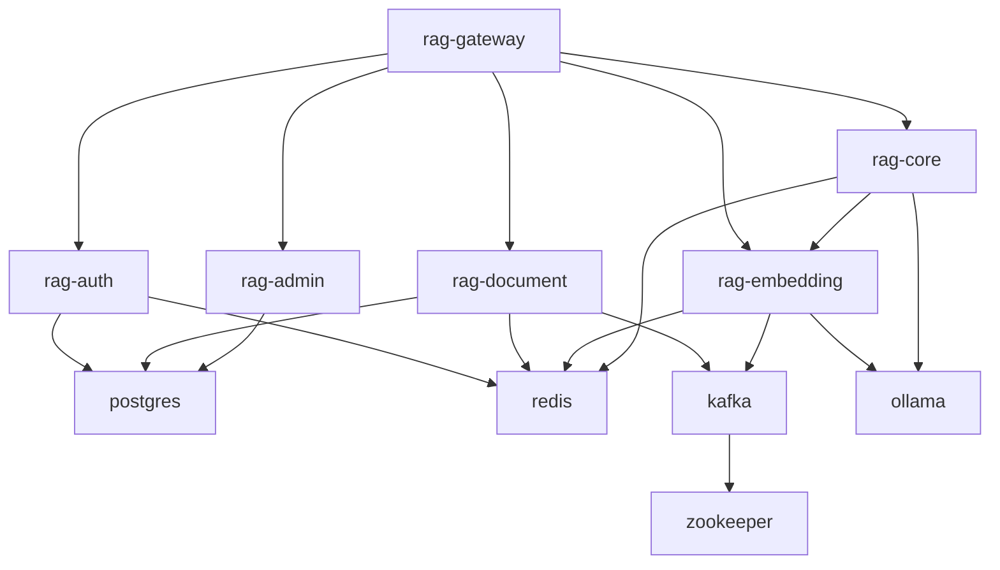

# 🐳 Docker Setup - BYO RAG System

[](https://www.docker.com/)
[]()
[]()

> **✅ Status (2025-10-01)**: All microservices deployed and operational. Docker deployment using `docker-compose.yml`. Gateway archived per ADR-001.

Complete Docker Compose configuration for the BYO RAG System with all 6 microservices, infrastructure components, and monitoring stack.

## 🚀 Quick Start

### Prerequisites
- **Docker Desktop** or **Colima** (recommended for macOS)
- **8GB+ RAM** (12GB+ recommended)  
- **20GB+ free disk space**

### For Colima Users (macOS)
```bash
# Start Colima with sufficient resources
colima start --memory 8 --cpu 4 --disk 60

# Verify Docker is running
docker info
```

### Start the System
```bash
# Start all services (or use: make start)
docker-compose up -d

# Check system health
./scripts/utils/health-check.sh

# View all service logs (or use: make logs)
docker-compose logs -f
```

## 📋 System Architecture

### 🏗️ Microservices Status (6/6 Complete)
| Service | Port | Status | Description |
|---------|------|---------|-------------|
| **rag-auth** | 8081 | ✅ **Working** | Authentication - JWT auth, user/tenant management |
| **rag-document** | 8082 | ✅ **Working** | Document Processing - File upload, text extraction, chunking |
| **rag-embedding** | 8083 | ✅ **Working** | Embedding Service - Vector generation and similarity search |
| **rag-admin** | 8085 | ✅ **Working** | Admin Service - System administration, analytics |
| **rag-core** | 8084 | ✅ **Working** | RAG Core - Query processing, LLM integration (8/8 tests passing) |
| **rag-gateway** | 8080 | ✅ **Working** | API Gateway - Routes all external traffic |

### 🔧 Infrastructure Services
| Service | Port | Description |
|---------|------|-------------|
| **postgres** | 5432 | PostgreSQL with pgvector extension |
| **redis** | 6379 | Redis Stack for vector storage and caching |
| **kafka** | 9092 | Apache Kafka for event-driven messaging |
| **zookeeper** | 2181 | Kafka coordination service |
| **ollama** | 11434 | Local LLM inference engine |

### 📊 Monitoring & Management
| Service | Port | Description | Credentials |
|---------|------|-------------|-------------|
| **grafana** | 3000 | Monitoring dashboards | admin/admin |
| **prometheus** | 9090 | Metrics collection | - |
| **kafka-ui** | 8080 | Kafka management interface | - |
| **redis-insight** | 8001 | Redis management (dev only) | - |
| **pgadmin** | 5050 | PostgreSQL admin (dev only) | admin@enterprise-rag.com/admin |

## 🔧 Service Dependencies



## 🛠️ Configuration Files & Current Status (2025-10-01)

### 🔧 Docker Compose Configurations
- **`docker-compose.yml`** - **CURRENT CONFIG** - All services operational and tested
- **`.env`** - Environment variables for Docker deployment
- **Old configs archived** - Previous docker-compose files moved to `archive/docker-old-2025-09/`

### 🔧 Infrastructure Configuration  
- **`docker/`** - Configuration files for infrastructure services
  - `postgres/init.sql` - Database initialization with pgvector extension
  - `prometheus/prometheus.yml` - Metrics configuration (fixed service endpoints)
  - `grafana/` - Dashboard and datasource configurations

### 🚀 Recent Achievements (2025-10-01)
- **✅ Docker Workflow Improvements**: Makefile, rebuild scripts, and enforcement mechanisms
- **✅ Gateway Archived**: Per ADR-001, using direct service access
- **✅ Complete Test Suite**: High test coverage with enterprise-grade patterns
- **✅ Full System Integration**: All services working together in Docker environment
- **✅ Documentation Complete**: Comprehensive documentation with clear organization

## 📝 Management Commands

### Basic Operations (Recommended: Use Makefile)
```bash
# Start all services
make start

# Stop all services
make stop

# View service status
make status

# View logs (all services)
make logs

# View logs (specific service)
make logs SERVICE=rag-auth

# Rebuild and restart a service
make rebuild SERVICE=rag-auth

# Rebuild with no cache
make rebuild-nc SERVICE=rag-auth

# Alternative: Direct Docker Compose
docker-compose up -d
docker-compose down
```

### Health Checks
```bash
# Run comprehensive health check
./scripts/utils/health-check.sh

# Check all service health (direct access per ADR-001)
curl http://localhost:8081/actuator/health  # Auth
curl http://localhost:8082/actuator/health  # Document
curl http://localhost:8083/actuator/health  # Embedding
curl http://localhost:8084/actuator/health  # Core
curl http://localhost:8085/admin/api/actuator/health  # Admin
# Gateway archived per ADR-001
```

### Database Operations
```bash
# Connect to PostgreSQL
docker-compose exec postgres psql -U rag_user -d rag_enterprise

# Connect to Redis CLI
docker-compose exec redis redis-cli -a redis_password

# View Kafka topics
docker-compose exec kafka kafka-topics --bootstrap-server localhost:9092 --list
```

## 🔍 Troubleshooting

### Common Issues

#### 🐌 Slow Startup
- **Symptoms**: Services take >5 minutes to start
- **Solutions**: 
  - Increase Docker/Colima memory to 8GB+
  - Increase CPU allocation to 4+ cores
  - Ensure sufficient disk space (20GB+)

#### 🚫 Port Conflicts
- **Symptoms**: "Port already in use" errors
- **Solutions**:
  - Check for conflicting services: `lsof -i :8080`
  - Modify ports in `docker-compose.yml` if needed

#### 💾 Out of Memory
- **Symptoms**: Services randomly stopping, OOMKilled
- **Solutions**:
  - Increase Docker memory allocation
  - Reduce JVM heap sizes in Dockerfiles
  - Monitor with `docker stats`

#### 🔌 Service Connectivity
- **Symptoms**: Services can't reach each other
- **Solutions**:
  - Verify all services use `rag-network`
  - Check service names match Docker container names
  - Use `docker-compose exec SERVICE_NAME ping OTHER_SERVICE`

### Logs and Debugging
```bash
# View container resource usage
docker stats

# Check service startup order
docker-compose logs --timestamps | sort

# Debug networking issues
docker network ls
docker network inspect rag_rag-network

# View environment variables
docker-compose exec rag-gateway env
```

## 🔐 Security Considerations

### Development Environment
- Default passwords are used (change for production)
- All services run on localhost
- Debug logging enabled

### Production Recommendations
- Use external secret management
- Enable SSL/TLS for all connections
- Implement proper backup strategies
- Use production-grade monitoring
- Apply security updates regularly

## 📈 Performance Optimization

### Resource Allocation
```yaml
# Recommended Colima settings
colima start --memory 12 --cpu 6 --disk 100

# JVM optimization for containers
JAVA_OPTS: "-Xms512m -Xmx2048m -XX:+UseG1GC -XX:+UseContainerSupport"
```

### Monitoring
- **Grafana**: System metrics and application dashboards
- **Prometheus**: Metrics collection and alerting
- **Application Health**: Built-in Spring Boot Actuator endpoints

## 🚀 Next Steps

1. **Start Services**: Run `make start` or `docker-compose up -d`
2. **Verify Health**: Run `./scripts/utils/health-check.sh`
3. **Test API**: Access services directly per ADR-001 (see URLs above)
4. **Monitor**: Open Grafana at `http://localhost:3000`
5. **Develop**: See [DOCKER_DEVELOPMENT.md](../development/DOCKER_DEVELOPMENT.md) for workflows

## 📞 Support

- Check service logs: `make logs SERVICE=<name>` or `docker-compose logs -f [service-name]`
- Run health check: `./scripts/utils/health-check.sh`
- View documentation: [docs/README.md](../README.md)
- Report issues: Create GitHub issue with logs and system info