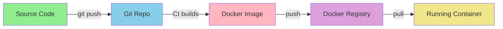

# Git and Docker: What to Commit

## Quick Answer

**NO, we do not commit Docker images to Git.**

## What Goes Where

### ✅ Commit to Git

```
Source code & configuration:
├── *.java                    # Source code
├── pom.xml                   # Maven config
├── Dockerfile                # Image build instructions
├── docker-compose.yml        # Service orchestration
├── .env.example              # Environment template
└── scripts/                  # Build/deploy scripts

Documentation:
├── README.md
├── CONTRIBUTING.md
└── docs/
```

### ❌ Never Commit (in .gitignore)

```
Build artifacts:
├── target/                   # Maven builds
├── *.jar                     # Compiled JARs
└── *.class                   # Compiled classes

Docker artifacts:
├── *.tar                     # Docker image exports
└── *.tar.gz                  # Compressed images

Secrets & environment:
├── .env                      # Real environment vars
├── *.pem                     # Private keys
├── *.key                     # Certificates
└── credentials.json          # Secrets

IDE & OS files:
├── .idea/                    # IntelliJ
├── .vscode/                  # VS Code
└── .DS_Store                 # macOS
```

### 🐳 Store in Docker Registry

```
Docker Hub, ECR, or private registry:
├── rag-auth:latest
├── rag-admin:latest
├── rag-document:latest
├── rag-embedding:latest
└── rag-core:latest
```

## Why Not Commit Docker Images?

### 1. Size

```bash
# Docker images are HUGE
$ docker images
REPOSITORY    TAG       SIZE
rag-auth      latest    780MB    # ❌ Too big for Git!
rag-admin     latest    782MB    # ❌ Would bloat repo
```

Git is optimized for **text files**, not **multi-GB binaries**.

### 2. Reproducibility

Images are **built from source**:

```dockerfile
# Dockerfile is in Git (✅)
FROM eclipse-temurin:21-jre
COPY target/app.jar app.jar
CMD ["java", "-jar", "app.jar"]
```

```bash
# Image is rebuilt from Dockerfile
docker build -t rag-auth:latest .
```

**Principle:** Commit the recipe (Dockerfile), not the meal (image).

### 3. Security

Images may contain:
- Secrets embedded during build
- Temporary credentials
- Build-time environment variables

**Better:** Build images in CI/CD with proper secrets management.

### 4. Registry is the Right Tool

Docker registries are designed for images:
- ✅ Deduplication (layers shared)
- ✅ Fast pulls
- ✅ Access control
- ✅ Scanning for vulnerabilities

## What About the Pre-Push Hook?

### It Checks LOCAL Docker State

```bash
# .githooks/pre-push checks:
docker images | grep "rag_rag-"
```

### NOT Checking Git Commits

The hook ensures you don't have **locally built** images with wrong names that might be referenced in code you're about to commit.

**Example scenario it prevents:**

```bash
# Developer manually builds with wrong name
docker build -t my-custom-rag-auth .

# Then updates docker-compose.yml
# docker-compose.yml
rag-auth:
  image: my-custom-rag-auth  # ❌ Wrong!

# Pre-push hook warns:
# "Found image with non-standard name: my-custom-rag-auth"
```

## Workflow: From Code to Running Container



1. **Code** → Git (with Dockerfile)
2. **CI/CD** → Builds image from code
3. **Image** → Pushed to registry
4. **Deploy** → Pulls from registry

## How to Share Images

### ❌ Wrong Way

```bash
# DON'T do this
docker save rag-auth > rag-auth.tar
git add rag-auth.tar
git commit -m "Add image"
```

### ✅ Right Way

```bash
# Push to registry
docker tag rag-auth:latest myregistry.com/rag-auth:v1.0
docker push myregistry.com/rag-auth:v1.0

# Others pull from registry
docker pull myregistry.com/rag-auth:v1.0
```

## Verification Commands

### Check Git Status

```bash
# Should NOT see any .jar, .tar, or image files
git status

# Check what's actually committed
git ls-files | grep -E '\.(jar|tar|image)$'
# Should return NOTHING (except maven wrapper)
```

### Check .gitignore Working

```bash
# Build the project
make build-all

# Check Git doesn't see build artifacts
git status
# Should show: "nothing to commit, working tree clean"
```

### Check Docker Images

```bash
# List local images
docker images | grep rag-

# Should see:
# rag-auth:latest
# rag-admin:latest
# etc.

# Should NOT see:
# rag_rag-auth
# docker-rag-auth
# my-custom-rag-*
```

## Common Questions

### "Can I export an image for backup?"

Yes, but store it **outside Git**:

```bash
# Export to file
docker save rag-auth:latest > ~/backups/rag-auth-$(date +%Y%m%d).tar

# Restore from file
docker load < ~/backups/rag-auth-20250101.tar
```

### "How do I share an image with a colleague?"

Use a registry (even local):

```bash
# Option 1: Docker Hub (public/private)
docker push yourname/rag-auth:latest

# Option 2: Self-hosted registry
docker run -d -p 5000:5000 registry:2
docker tag rag-auth:latest localhost:5000/rag-auth
docker push localhost:5000/rag-auth
```

### "What if I don't have a registry?"

Use the rebuild script:

```bash
# Share the CODE (in Git)
git clone https://github.com/yourorg/rag-system
cd rag-system/RAG

# Colleague rebuilds locally
make build-all
make start
```

### "Is the maven wrapper JAR committed?"

Yes! The maven wrapper (`/.mvn/wrapper/maven-wrapper.jar`) is an **exception**.

```gitignore
# Ignore all JARs
*.jar

# Except the maven wrapper
!.mvn/wrapper/maven-wrapper.jar
```

This is intentional - the wrapper enables building without Maven installed.

## Summary

| Item | Git | Registry | Local Only |
|------|-----|----------|------------|
| Source code (*.java) | ✅ | ❌ | ❌ |
| Dockerfile | ✅ | ❌ | ❌ |
| docker-compose.yml | ✅ | ❌ | ❌ |
| Docker images | ❌ | ✅ | ✅ |
| Build JARs (target/) | ❌ | ❌ | ✅ |
| Secrets (.env) | ❌ | ❌ | ✅ |

**Golden Rule:**
- **Code** → Git
- **Images** → Registry
- **Secrets** → Vault/env vars

---

**See Also:**
- [.gitignore](.gitignore) - What we ignore
- [.githooks/pre-push](.githooks/pre-push) - Pre-push validation
- [Docker Development Guide](DOCKER_DEVELOPMENT.md) - Docker workflow
