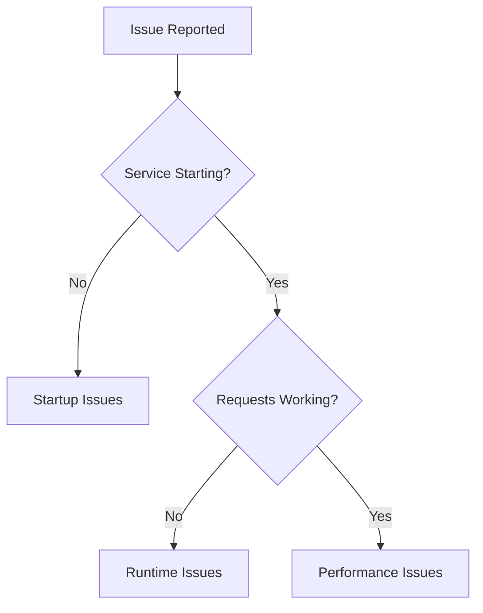

# Documentation Templates & Standards

**Version**: 1.0  
**Created**: 2025-09-22  
**Last Updated**: 2025-09-22

## Overview

This document provides standardized templates and guidelines for creating consistent, high-quality documentation across the Enterprise RAG System project.

## Table of Contents

1. [Document Templates](#1-document-templates)
2. [Style Guide](#2-style-guide)
3. [Code Documentation Standards](#3-code-documentation-standards)
4. [Review Checklist](#4-review-checklist)

---

## 1. Document Templates

### 1.1 Service Specification Template

```markdown
# [Service Name] - Technical Specification

**Document Version**: 1.0  
**Created**: YYYY-MM-DD  
**Status**: [Draft/Complete/Under Review]  
**Service Version**: [Version Number]

## Table of Contents

1. [Overview](#1-overview)
2. [Service Architecture](#2-service-architecture)
3. [API Specification](#3-api-specification)
4. [Data Models](#4-data-models)
5. [Security](#5-security)
6. [Performance](#6-performance)
7. [Deployment](#7-deployment)
8. [Monitoring](#8-monitoring)

## 1. Overview

### 1.1 Service Purpose
[Brief description of what this service does and why it exists]

### 1.2 Key Responsibilities
- [List primary responsibilities]
- [One responsibility per bullet point]

### 1.3 Technology Stack
- **Framework**: [e.g., Spring Boot 3.2.8]
- **Database**: [e.g., PostgreSQL]
- **Dependencies**: [Key dependencies]

## 2. Service Architecture

### 2.1 Component Diagram
```mermaid
[Include architecture diagram]
```

### 2.2 Design Patterns
[Document key architectural patterns used]

## 3. API Specification

### 3.1 Endpoints

#### 3.1.1 [Endpoint Name]
```http
[HTTP_METHOD] /api/v1/resource
Content-Type: application/json
X-Tenant-ID: {tenant-uuid}

{
  "example": "request"
}
```

**Response**:
```json
{
  "status": "success",
  "data": {
    "example": "response"
  }
}
```

## 4. Data Models

### 4.1 [Entity Name]
```java
@Entity
public class ExampleEntity {
    // Entity definition
}
```

## 5. Security

### 5.1 Authentication
[Authentication mechanisms]

### 5.2 Authorization
[Authorization rules]

## 6. Performance

### 6.1 Response Times
[Performance targets and measurements]

### 6.2 Scalability
[Scaling characteristics]

## 7. Deployment

### 7.1 Container Configuration
[Docker/container setup]

### 7.2 Infrastructure Requirements
[Resource requirements]

## 8. Monitoring

### 8.1 Health Checks
[Health check endpoints]

### 8.2 Metrics
[Key metrics to monitor]

---

**Document Metadata**:
- **Maintainer**: [Team/Individual]
- **Review Cycle**: [Frequency]
- **Related Documents**: [Links to related docs]
```

### 1.2 API Documentation Template

```markdown
# [Service Name] API Reference

**Version**: [API Version]  
**Base URL**: `http://localhost:[port]/api/v1`  
**Authentication**: JWT Bearer Token

## Authentication

All API requests require authentication via JWT token in the Authorization header:

```http
Authorization: Bearer <jwt_token>
X-Tenant-ID: <tenant_uuid>
```

## Endpoints

### [Resource Name]

#### Create [Resource]

```http
POST /api/v1/[resource]
Content-Type: application/json
```

**Request Body**:
```json
{
  "field1": "string",
  "field2": "integer",
  "field3": "boolean"
}
```

**Response**: `201 Created`
```json
{
  "status": "success",
  "data": {
    "id": "uuid",
    "field1": "string",
    "field2": 123,
    "field3": true,
    "createdAt": "2025-09-22T10:30:00Z"
  }
}
```

**Error Responses**:
- `400 Bad Request`: Invalid input data
- `401 Unauthorized`: Missing or invalid authentication
- `403 Forbidden`: Insufficient permissions
- `409 Conflict`: Resource already exists

**Example**:
```bash
curl -X POST http://localhost:8080/api/v1/resource \
  -H "Content-Type: application/json" \
  -H "Authorization: Bearer eyJ0eXAi..." \
  -H "X-Tenant-ID: 550e8400-e29b-41d4-a716-446655440000" \
  -d '{
    "field1": "example",
    "field2": 42,
    "field3": true
  }'
```

#### List [Resources]

```http
GET /api/v1/[resource]?page=0&size=20&sort=createdAt,desc
```

**Query Parameters**:
- `page` (integer, optional): Page number (default: 0)
- `size` (integer, optional): Page size (default: 20, max: 100)
- `sort` (string, optional): Sort field and direction

**Response**: `200 OK`
```json
{
  "status": "success",
  "data": {
    "content": [
      {
        "id": "uuid",
        "field1": "string",
        "createdAt": "2025-09-22T10:30:00Z"
      }
    ],
    "pageable": {
      "pageNumber": 0,
      "pageSize": 20
    },
    "totalElements": 150,
    "totalPages": 8
  }
}
```

## Error Handling

All errors follow a consistent format:

```json
{
  "status": "error",
  "error": {
    "code": "ERROR_CODE",
    "message": "Human-readable error message",
    "details": {
      "field": "Additional error details"
    }
  },
  "timestamp": "2025-09-22T10:30:00Z",
  "requestId": "uuid"
}
```

### Common Error Codes

| Code | HTTP Status | Description |
|------|-------------|-------------|
| `VALIDATION_ERROR` | 400 | Request validation failed |
| `AUTHENTICATION_REQUIRED` | 401 | Missing authentication |
| `ACCESS_DENIED` | 403 | Insufficient permissions |
| `RESOURCE_NOT_FOUND` | 404 | Resource does not exist |
| `TENANT_LIMIT_EXCEEDED` | 429 | Rate limit exceeded |
| `INTERNAL_ERROR` | 500 | Server error |

## Rate Limiting

API requests are rate limited per tenant:
- **Default**: 1000 requests per hour
- **Burst**: 100 requests per minute

Rate limit headers are included in responses:
```http
X-RateLimit-Limit: 1000
X-RateLimit-Remaining: 999
X-RateLimit-Reset: 1632150000
```
```

### 1.3 Developer Guide Template

```markdown
# [Feature/Service] Developer Guide

**Audience**: Developers  
**Prerequisites**: [List prerequisites]  
**Estimated Time**: [Time to complete]

## Overview

[Brief description of what this guide covers and why it's useful]

## Prerequisites

Before starting, ensure you have:
- [ ] [Prerequisite 1]
- [ ] [Prerequisite 2]
- [ ] [Environment setup complete]

## Step-by-Step Instructions

### Step 1: [First Step]

[Detailed instructions for the first step]

```bash
# Example command with explanation
command --flag value
```

**Expected Output**:
```
Expected output example
```

**Troubleshooting**:
- **Issue**: Common problem description
- **Solution**: How to resolve it

### Step 2: [Second Step]

[Continue with additional steps...]

## Code Examples

### Basic Usage

```java
// Java example with comments
@Service
public class ExampleService {
    
    /**
     * Example method showing proper usage.
     */
    public String example() {
        // Implementation details
        return "result";
    }
}
```

### Advanced Usage

```java
// More complex example
@RestController
public class ExampleController {
    
    @PostMapping("/api/example")
    public ResponseEntity<String> handleRequest(@RequestBody ExampleDto dto) {
        // Advanced implementation
        return ResponseEntity.ok("success");
    }
}
```

## Testing

### Unit Tests

```java
@Test
void shouldHandleExample() {
    // Given
    ExampleService service = new ExampleService();
    
    // When
    String result = service.example();
    
    // Then
    assertThat(result).isEqualTo("expected");
}
```

### Integration Tests

```java
@SpringBootTest
@TestMethodOrder(OrderAnnotation.class)
class ExampleIntegrationTest {
    
    @Test
    @Order(1)
    void shouldCreateResource() {
        // Integration test example
    }
}
```

## Best Practices

- **Do**: [Recommended practice]
- **Don't**: [Anti-pattern to avoid]
- **Consider**: [Optional optimization]

## Common Issues

### Issue 1: [Problem Description]

**Symptoms**:
- [How to identify this issue]

**Cause**:
- [Why this happens]

**Solution**:
```bash
# Commands to fix the issue
fix-command --parameter
```

### Issue 2: [Another Problem]

[Continue with additional common issues...]

## Related Resources

- [Link to related documentation]
- [Link to API reference]
- [Link to examples repository]

## Next Steps

After completing this guide, you might want to:
- [Suggested next action]
- [Related guide to follow]
- [Advanced topic to explore]
```

### 1.4 Troubleshooting Guide Template

```markdown
# [Component] Troubleshooting Guide

**Last Updated**: YYYY-MM-DD  
**Applies To**: [Version range]

## Quick Diagnosis

Use this flowchart to quickly identify the issue category:



## Common Issues

### Startup Issues

#### Service Won't Start

**Symptoms**:
- Application fails to start
- Port binding errors
- Database connection failures

**Diagnostic Steps**:
1. Check service logs:
   ```bash
   docker-compose logs [service-name]
   ```

2. Verify port availability:
   ```bash
   netstat -tulpn | grep :[port]
   ```

3. Test database connectivity:
   ```bash
   docker exec -it postgres psql -U user -d database
   ```

**Common Solutions**:

| Problem | Solution |
|---------|----------|
| Port already in use | Kill process: `kill $(lsof -ti :[port])` |
| Database not ready | Wait for database: `./scripts/wait-for-services.sh` |
| Missing environment variables | Check `.env` file configuration |

### Runtime Issues

#### Authentication Failures

**Symptoms**:
- 401 Unauthorized responses
- JWT token errors
- Session timeout issues

**Diagnostic Commands**:
```bash
# Check JWT token validity
curl -H "Authorization: Bearer $TOKEN" http://localhost:8080/api/auth/validate

# Verify token claims
echo $TOKEN | base64 -d | jq '.'
```

**Solutions**:
- **Expired Token**: Request new token via `/api/auth/refresh`
- **Invalid Claims**: Check tenant_id in token matches request
- **Service Communication**: Verify auth service is running

### Performance Issues

#### Slow Response Times

**Symptoms**:
- API responses > 2 seconds
- Database query timeouts
- Memory usage spikes

**Performance Analysis**:
```bash
# Check service metrics
curl http://localhost:8080/actuator/metrics

# Monitor resource usage
docker stats

# Database query analysis
docker exec -it postgres psql -c "SELECT * FROM pg_stat_activity;"
```

**Optimization Steps**:
1. **Database**: Add indexes, optimize queries
2. **Caching**: Enable Redis caching
3. **JVM**: Tune memory settings
4. **Connection Pools**: Adjust pool sizes

## Debugging Procedures

### Enable Debug Logging

Add to `application.yml`:
```yaml
logging:
  level:
    com.byo.rag: DEBUG
    org.springframework.security: DEBUG
    org.hibernate.SQL: DEBUG
```

### Health Check Commands

```bash
# Service health
curl http://localhost:[port]/actuator/health

# Database health
docker exec postgres pg_isready

# Redis health
docker exec redis redis-cli ping
```

### Log Analysis

```bash
# Service logs
docker-compose logs -f [service-name]

# Filter for errors
docker-compose logs [service-name] | grep ERROR

# Follow specific patterns
docker-compose logs -f [service-name] | grep -E "(ERROR|WARN|Exception)"
```

## Escalation Procedures

### When to Escalate

Escalate to the development team when:
- [ ] Issue persists after following troubleshooting steps
- [ ] System-wide impact affecting multiple services
- [ ] Data integrity concerns
- [ ] Security-related issues

### Information to Collect

Before escalating, collect:
- [ ] Service logs (last 100 lines minimum)
- [ ] Error messages and stack traces
- [ ] Steps to reproduce the issue
- [ ] System resource usage (CPU, memory, disk)
- [ ] Recent changes or deployments

### Contact Information

- **Development Team**: [Contact details]
- **DevOps Team**: [Contact details]
- **Emergency Contacts**: [24/7 contacts]

## Monitoring and Alerts

### Key Metrics to Monitor

- **Response Time**: Average < 200ms
- **Error Rate**: < 1% of requests
- **CPU Usage**: < 80% sustained
- **Memory Usage**: < 85% of allocated
- **Database Connections**: < 80% of pool

### Alert Thresholds

| Metric | Warning | Critical |
|--------|---------|----------|
| Response Time | > 500ms | > 2000ms |
| Error Rate | > 2% | > 5% |
| CPU Usage | > 80% | > 95% |
| Memory Usage | > 85% | > 95% |
| Disk Usage | > 80% | > 90% |
```

---

## 2. Style Guide

### 2.1 Writing Style

**Tone & Voice**:
- **Professional but approachable**: Use clear, direct language
- **Consistent terminology**: Maintain a glossary of terms
- **Active voice preferred**: "Configure the service" vs "The service should be configured"
- **Scannable content**: Use headers, bullet points, and short paragraphs

**Language Guidelines**:
- Use present tense for instructions
- Use future tense for outcomes
- Avoid jargon without explanation
- Define acronyms on first use

### 2.2 Formatting Standards

#### Headers
```markdown
# H1: Document Title (used once per document)
## H2: Major Sections
### H3: Subsections
#### H4: Detailed Topics (avoid going deeper)
```

#### Text Formatting
```markdown
**Bold**: Important concepts, UI elements, field names
*Italic*: Emphasis, book titles, variable names
`Code`: Inline code, file names, commands, API endpoints
~~Strikethrough~~: Deprecated content (use sparingly)
```

#### Lists
```markdown
# Unordered lists for non-sequential items
- First item
- Second item
  - Nested item (max 2 levels)

# Ordered lists for sequential steps
1. First step
2. Second step
3. Third step

# Checklist for actionable items
- [ ] Task to complete
- [x] Completed task
```

#### Code Blocks
```markdown
```language
// Always specify the language
// Include comments for clarity
// Keep examples concise but complete
const example = "Hello World";
```
```

#### Links
```markdown
# Internal links (preferred)
[Link Text](relative/path/to/document.md)

# External links
[External Resource](https://example.com)

# Reference links for repeated URLs
[Link Text][ref-label]

[ref-label]: https://example.com
```

#### Tables
```markdown
| Column 1 | Column 2 | Column 3 |
|----------|----------|----------|
| Data 1   | Data 2   | Data 3   |
| Data 4   | Data 5   | Data 6   |

# Add alignment when helpful
| Left | Center | Right |
|:-----|:------:|------:|
| Text | Text   | Text  |
```

### 2.3 Document Structure

#### Required Sections
Every technical document should include:

1. **Front Matter**:
   ```markdown
   # Document Title
   
   **Version**: 1.0  
   **Created**: YYYY-MM-DD  
   **Last Updated**: YYYY-MM-DD  
   **Audience**: [Target audience]
   ```

2. **Table of Contents** (for documents > 1000 words)
3. **Overview/Introduction**
4. **Prerequisites** (if applicable)
5. **Main Content**
6. **Troubleshooting** (if applicable)
7. **Related Resources**

#### Optional Sections
- **Examples**
- **Best Practices**
- **Performance Considerations**
- **Security Notes**
- **Migration Guide**

---

## 3. Code Documentation Standards

### 3.1 Java Documentation

#### Class Documentation
```java
/**
 * Service responsible for [primary purpose].
 * 
 * <p>This service handles [key responsibilities] and integrates with
 * [dependencies] to provide [business value].
 * 
 * <p>Example usage:
 * <pre>{@code
 * ExampleService service = new ExampleService();
 * String result = service.performOperation("input");
 * }</pre>
 * 
 * @author Enterprise RAG Team
 * @since 0.8.0
 * @version 1.0
 * @see RelatedClass
 */
@Service
public class ExampleService {
    // Implementation
}
```

#### Method Documentation
```java
/**
 * Performs [operation description] with the given parameters.
 * 
 * <p>This method [detailed description of what it does, when to use it,
 * and any important side effects or considerations].
 * 
 * @param input the input parameter description, including constraints
 * @param options configuration options for the operation
 * @return description of return value and its structure
 * @throws IllegalArgumentException if input is null or invalid
 * @throws ServiceException if operation fails due to external dependencies
 * @since 0.8.0
 */
public String performOperation(String input, Map<String, Object> options) 
        throws IllegalArgumentException, ServiceException {
    // Implementation
}
```

#### Field Documentation
```java
/**
 * Configuration for [purpose].
 * 
 * <p>This field [description of what it configures and default behavior].
 */
@Value("${service.timeout:30000}")
private int timeoutMillis;
```

### 3.2 Configuration Documentation

#### Application Properties
```yaml
# Service Configuration
service:
  # Connection timeout in milliseconds (default: 30000)
  timeout: 30000
  
  # Maximum retry attempts for failed operations (default: 3)
  max-retries: 3
  
  # Feature flags
  features:
    # Enable advanced caching (default: true)
    caching-enabled: true
    
    # Enable metrics collection (default: true)
    metrics-enabled: true
```

#### Docker Configuration
```dockerfile
# Use official OpenJDK base image
FROM openjdk:21-jre-slim

# Set working directory
WORKDIR /app

# Copy application jar
COPY target/service-*.jar app.jar

# Expose service port
EXPOSE 8080

# Health check configuration
HEALTHCHECK --interval=30s --timeout=3s --start-period=5s --retries=3 \
  CMD curl -f http://localhost:8080/actuator/health || exit 1

# Run application
ENTRYPOINT ["java", "-jar", "/app.jar"]
```

### 3.3 API Documentation

#### Controller Documentation
```java
/**
 * REST controller for [resource] operations.
 * 
 * <p>Provides endpoints for CRUD operations on [resource] entities
 * with full multi-tenant support and security validation.
 * 
 * @author Enterprise RAG Team
 * @since 0.8.0
 */
@RestController
@RequestMapping("/api/v1/resources")
@Tag(name = "Resources", description = "Resource management operations")
public class ResourceController {
    
    /**
     * Creates a new resource with the provided data.
     * 
     * @param request the resource creation request
     * @param tenantId the tenant identifier from header
     * @return the created resource with generated ID
     */
    @PostMapping
    @Operation(summary = "Create resource", 
               description = "Creates a new resource for the authenticated tenant")
    @ApiResponses({
        @ApiResponse(responseCode = "201", description = "Resource created successfully"),
        @ApiResponse(responseCode = "400", description = "Invalid request data"),
        @ApiResponse(responseCode = "401", description = "Authentication required"),
        @ApiResponse(responseCode = "403", description = "Access denied")
    })
    public ResponseEntity<ResourceDto> createResource(
            @Valid @RequestBody CreateResourceRequest request,
            @RequestHeader("X-Tenant-ID") UUID tenantId) {
        // Implementation
    }
}
```

---

## 4. Review Checklist

### 4.1 Content Review Checklist

#### Accuracy & Completeness
- [ ] All information is technically accurate
- [ ] Code examples have been tested
- [ ] All links are working and current
- [ ] Prerequisites are clearly stated
- [ ] All steps are included and in correct order

#### Clarity & Usability
- [ ] Purpose and audience are clear
- [ ] Language is appropriate for target audience
- [ ] Instructions are unambiguous
- [ ] Examples are relevant and helpful
- [ ] Troubleshooting section is comprehensive

#### Structure & Organization
- [ ] Logical flow of information
- [ ] Consistent heading hierarchy
- [ ] Table of contents (if needed)
- [ ] Proper use of formatting
- [ ] Related resources are linked

### 4.2 Technical Review Checklist

#### Code Quality
- [ ] Code examples follow project standards
- [ ] Security best practices are demonstrated
- [ ] Error handling is included
- [ ] Performance considerations are noted
- [ ] Dependencies are current and secure

#### Integration
- [ ] Integrates properly with existing documentation
- [ ] Cross-references are accurate
- [ ] Terminology is consistent across documents
- [ ] Version information is current
- [ ] Breaking changes are highlighted

### 4.3 Style Review Checklist

#### Writing Style
- [ ] Consistent tone and voice
- [ ] Grammar and spelling are correct
- [ ] Active voice is used where appropriate
- [ ] Terminology follows style guide
- [ ] Sentences are concise and clear

#### Formatting
- [ ] Consistent markdown formatting
- [ ] Proper code block formatting
- [ ] Tables are well-structured
- [ ] Lists are appropriately formatted
- [ ] Headers follow hierarchy rules

### 4.4 Maintenance Checklist

#### Documentation Lifecycle
- [ ] Author and creation date are recorded
- [ ] Review schedule is established
- [ ] Update triggers are identified
- [ ] Deprecation process is defined
- [ ] Archive criteria are established

#### Quality Assurance
- [ ] Link checking is automated
- [ ] Code examples are tested
- [ ] Review process is documented
- [ ] Feedback mechanism is available
- [ ] Metrics are being collected

---

## Usage Guidelines

### When to Use Each Template

- **Service Specification**: For comprehensive technical documentation of microservices
- **API Documentation**: For detailed API endpoint documentation
- **Developer Guide**: For step-by-step tutorials and how-to guides
- **Troubleshooting Guide**: For problem diagnosis and resolution procedures

### Customization Guidelines

These templates should be adapted based on:
- **Audience**: Adjust technical depth and language
- **Scope**: Add or remove sections as needed
- **Context**: Include project-specific information
- **Format**: Adapt for different output formats (web, PDF, etc.)

### Review and Update Process

1. **Initial Creation**: Follow template structure and style guide
2. **Peer Review**: Technical and editorial review using checklists
3. **User Testing**: Validate with actual users when possible
4. **Regular Updates**: Review and update based on feedback and changes
5. **Quality Monitoring**: Track usage and effectiveness metrics

---

**Document Information**:
- **Templates Available**: 4 core templates
- **Style Guide Sections**: 3 comprehensive sections
- **Review Checklists**: 4 detailed checklists
- **Usage Guidelines**: Complete implementation guidance