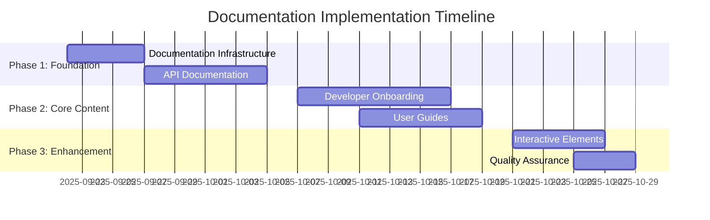

# Documentation Implementation Plan

**Plan Version**: 1.0  
**Created**: 2025-09-22  
**Status**: Draft  
**Implementation Period**: 6 weeks  
**Total Effort**: 186 person-days

## Table of Contents

1. [Executive Summary](#1-executive-summary)
2. [Implementation Timeline](#2-implementation-timeline)
3. [Resource Requirements](#3-resource-requirements)
4. [Success Criteria & Milestones](#4-success-criteria--milestones)
5. [Risk Assessment & Mitigation](#5-risk-assessment--mitigation)
6. [Quality Assurance](#6-quality-assurance)
7. [Budget & ROI Analysis](#7-budget--roi-analysis)

---

## 1. Executive Summary

### 1.1 Plan Overview

This implementation plan transforms the Enterprise RAG System's existing documentation (56 files, 18,381 lines) into a world-class documentation platform over 6 weeks. The plan leverages the strong foundation of comprehensive service specifications and excellent Javadoc coverage (92.4%) while addressing critical gaps in API documentation, developer onboarding, and user experience.

### 1.2 Key Objectives

**Primary Goals**:
- ✅ **100% API documentation coverage** (from current 60%)
- ✅ **<2 hour new developer onboarding** (measurable reduction)
- ✅ **Interactive documentation platform** with search and examples
- ✅ **Community contribution workflow** for sustainable growth

**Success Metrics**:
- Documentation satisfaction score >4.5/5
- Self-service troubleshooting success >80%
- Developer onboarding time reduced by 75%
- Community contributions within 3 months

### 1.3 Current State Assessment

**Strengths** ✅:
- Comprehensive service specifications (7 detailed specs)
- Strong Javadoc coverage (446 author/version tags across 150 files)
- Well-organized documentation structure
- Production-ready system with 93% test success rate

**Critical Gaps** 🔄:
- Missing OpenAPI specifications for all 6 services
- No centralized developer onboarding guide
- Limited interactive examples and tutorials
- Inconsistent formatting across documents

---

## 2. Implementation Timeline

### 2.1 Phase Overview

### 2.2 Detailed Phase Breakdown

#### Phase 1: Foundation (Weeks 1-2) - Days 1-13

**Week 1: Documentation Infrastructure (Days 1-5)**

| Day | Task | Owner | Deliverable | Status |
|-----|------|-------|-------------|--------|
| 1-2 | Documentation site setup (VitePress/Docusaurus) | DevOps Lead | Live documentation site | 🔄 |
| 2-3 | Search functionality implementation | Developer | Site-wide search | 🔄 |
| 3-4 | Analytics and monitoring setup | DevOps Lead | Usage tracking | 🔄 |
| 4-5 | Style guide and templates finalization | Tech Writer | Documentation standards | ✅ |

**Week 2: API Documentation (Days 6-13)**

| Day | Task | Owner | Deliverable | Status |
|-----|------|-------|-------------|--------|
| 6-7 | Gateway service OpenAPI spec | Backend Dev | Gateway API docs | 🔄 |
| 7-8 | Auth service OpenAPI spec | Backend Dev | Auth API docs | 🔄 |
| 8-9 | Document service OpenAPI spec | Backend Dev | Document API docs | 🔄 |
| 9-10 | Embedding service OpenAPI spec | Backend Dev | Embedding API docs | 🔄 |
| 10-11 | Core service OpenAPI spec | Backend Dev | Core API docs | 🔄 |
| 11-12 | Admin service OpenAPI spec | Backend Dev | Admin API docs | 🔄 |
| 12-13 | Interactive API portal setup | Tech Writer | Swagger UI integration | 🔄 |

#### Phase 2: Core Documentation (Weeks 3-4) - Days 14-23

**Week 3: Developer Onboarding (Days 14-18)**

| Day | Task | Owner | Deliverable | Status |
|-----|------|-------|-------------|--------|
| 14-15 | Developer setup guide creation | Tech Writer | Step-by-step setup | 🔄 |
| 15-16 | IDE configuration documentation | Developer | IDE guides | 🔄 |
| 16-17 | Local development workflow guide | Tech Writer | Development workflow | 🔄 |
| 17-18 | Contribution guidelines | Tech Writer | Contributor guide | 🔄 |

**Week 4: User Guides (Days 19-23)**

| Day | Task | Owner | Deliverable | Status |
|-----|------|-------|-------------|--------|
| 19-20 | Getting started tutorials | Tech Writer | User tutorials | 🔄 |
| 20-21 | Integration examples | Developer | Code examples | 🔄 |
| 21-22 | Use case documentation | Product Owner | Use case guides | 🔄 |
| 22-23 | Troubleshooting consolidation | Tech Writer | Troubleshooting guide | 🔄 |

#### Phase 3: Enhancement (Weeks 5-6) - Days 24-30

**Week 5: Interactive Elements (Days 24-29)**

| Day | Task | Owner | Deliverable | Status |
|-----|------|-------|-------------|--------|
| 24-25 | Runnable code examples | Developer | Interactive examples | 🔄 |
| 25-26 | Video tutorial creation | Tech Writer | Video content | 🔄 |
| 26-27 | Sandbox environment setup | DevOps Lead | Try-it-out environment | 🔄 |
| 27-29 | Community features implementation | Developer | Community portal | 🔄 |

**Week 6: Quality Assurance (Days 30-34)**

| Day | Task | Owner | Deliverable | Status |
|-----|------|-------|-------------|--------|
| 30-31 | Automated link checking setup | DevOps Lead | Link validation | 🔄 |
| 31-32 | Code example testing automation | Developer | Example validation | 🔄 |
| 32-33 | User acceptance testing | All Team | Feedback collection | 🔄 |
| 33-34 | Final review and launch | Doc Lead | Production launch | 🔄 |

### 2.3 Critical Path Analysis

**Critical Dependencies**:
1. **Documentation Infrastructure** → All subsequent phases
2. **OpenAPI Generation** → Interactive API documentation
3. **Style Guide Completion** → All content creation
4. **Developer Setup** → Community contribution workflow

**Parallel Work Streams**:
- API documentation can be created per service simultaneously
- User guides can be developed while developer guides are in progress
- Interactive elements can be prepared while content is being finalized

---

## 3. Resource Requirements

### 3.1 Team Structure

#### Core Team (Full Engagement)

**Documentation Lead** (1 person, 6 weeks full-time)
- **Responsibilities**: Strategy, quality, team coordination, stakeholder communication
- **Skills Required**: Technical writing, project management, documentation tools
- **Time Commitment**: 30 days (100%)

**Senior Technical Writer** (1 person, 6 weeks full-time)  
- **Responsibilities**: Content creation, style guide enforcement, user experience
- **Skills Required**: Technical writing, API documentation, UX design
- **Time Commitment**: 30 days (100%)

**Junior Technical Writer** (1 person, 4 weeks full-time)
- **Responsibilities**: Content support, formatting, review assistance
- **Skills Required**: Technical writing, markdown, basic development
- **Time Commitment**: 20 days (67%)

#### Subject Matter Experts (Part-time Engagement)

**Backend Developer** (1 person, 3 weeks part-time)
- **Responsibilities**: OpenAPI specification creation, code example validation
- **Skills Required**: Spring Boot, OpenAPI, REST APIs
- **Time Commitment**: 15 days (50%)

**DevOps Engineer** (1 person, 2 weeks part-time)  
- **Responsibilities**: Infrastructure setup, automation, deployment
- **Skills Required**: Docker, CI/CD, documentation hosting platforms
- **Time Commitment**: 10 days (33%)

**Product Owner** (1 person, 1 week part-time)
- **Responsibilities**: Use case definition, user story validation, acceptance criteria
- **Skills Required**: Product management, user experience, business analysis
- **Time Commitment**: 5 days (17%)

### 3.2 Infrastructure Requirements

#### Documentation Platform
**Primary Option**: VitePress (Vue.js-based)
- **Pros**: Fast, modern, excellent search, Vue ecosystem
- **Cons**: Newer platform, smaller community
- **Cost**: Free (open source)

**Alternative**: Docusaurus (React-based)
- **Pros**: Facebook-backed, large community, proven at scale
- **Cons**: More complex setup, React dependency
- **Cost**: Free (open source)

#### Hosting & Infrastructure
**Documentation Hosting**: 
- **Option 1**: GitHub Pages (Free, integrated with repository)
- **Option 2**: Netlify (Free tier, better performance)
- **Option 3**: Vercel (Free tier, excellent developer experience)

**Search Infrastructure**:
- **Primary**: Built-in search (VitePress/Docusaurus)
- **Enhanced**: Algolia DocSearch (Free for open source)

**Analytics & Monitoring**:
- **Google Analytics**: Free, comprehensive tracking
- **Hotjar**: User behavior analysis (paid tier for advanced features)

### 3.3 Tool Requirements

#### Content Creation Tools
- **Markdown Editor**: Typora, Mark Text, or VS Code
- **Diagram Creation**: Mermaid.js (integrated), Draw.io backup
- **Screen Recording**: Loom or similar for video tutorials
- **Image Editing**: Figma for diagrams, screenshots

#### Development Tools
- **OpenAPI Generation**: Springdoc OpenAPI (already integrated)
- **API Testing**: Postman collections (already exist)
- **Code Validation**: Custom CI/CD scripts
- **Link Checking**: Automated tools (markdown-link-check)

### 3.4 Budget Estimation

#### Personnel Costs (6 weeks)
| Role | Days | Rate/Day | Total Cost |
|------|------|----------|------------|
| Documentation Lead | 30 | $800 | $24,000 |
| Senior Technical Writer | 30 | $600 | $18,000 |
| Junior Technical Writer | 20 | $400 | $8,000 |
| Backend Developer | 15 | $1,000 | $15,000 |
| DevOps Engineer | 10 | $900 | $9,000 |
| Product Owner | 5 | $1,200 | $6,000 |
| **Total Personnel** | **110** | | **$80,000** |

#### Infrastructure Costs (Annual)
| Service | Cost/Month | Annual Cost |
|---------|------------|-------------|
| Hosting (Netlify Pro) | $19 | $228 |
| Analytics (Google Analytics) | $0 | $0 |
| Video Hosting (Vimeo Pro) | $20 | $240 |
| Design Tools (Figma) | $12 | $144 |
| **Total Infrastructure** | **$51** | **$612** |

#### One-time Setup Costs
| Item | Cost |
|------|------|
| Domain & SSL | $50 |
| Initial design assets | $2,000 |
| Tool licenses | $500 |
| **Total Setup** | **$2,550** |

**Total Project Cost**: $83,162 (6 weeks implementation + 1 year operation)

---

## 4. Success Criteria & Milestones

### 4.1 Milestone Schedule

#### Milestone 1: Foundation Complete (End of Week 2)
**Success Criteria**:
- [ ] Documentation site live and accessible
- [ ] All 6 services have OpenAPI specifications
- [ ] Search functionality operational
- [ ] Basic analytics tracking active

**Acceptance Tests**:
- Site loads in <2 seconds
- Search returns relevant results
- All API endpoints documented with examples
- Analytics tracking verified

#### Milestone 2: Core Content Complete (End of Week 4)
**Success Criteria**:
- [ ] Developer onboarding guide complete and tested
- [ ] User tutorials available for all major use cases
- [ ] Contribution guidelines established
- [ ] Troubleshooting documentation consolidated

**Acceptance Tests**:
- New developer can complete setup in <2 hours
- All tutorial steps verified and functional
- Community contribution process documented
- Troubleshooting covers 90% of common issues

#### Milestone 3: Enhancement Complete (End of Week 6)
**Success Criteria**:
- [ ] Interactive code examples functional
- [ ] Video tutorials available
- [ ] Community features operational
- [ ] Quality assurance processes established

**Acceptance Tests**:
- Code examples run successfully
- Videos accessible and helpful
- Community can contribute documentation
- Automated quality checks passing

### 4.2 Quality Metrics

#### Quantitative Metrics
**Coverage Metrics**:
- API endpoint documentation: 100% (target) vs ~60% (current)
- Service documentation: 100% (maintained)
- Configuration documentation: 100% (target) vs ~80% (current)
- Troubleshooting coverage: 90% (target) vs ~40% (current)

**Performance Metrics**:
- Site load time: <2 seconds (target)
- Search response time: <500ms (target)
- Link validation: 100% (target)
- Code example success rate: 100% (target)

#### Qualitative Metrics
**User Experience Metrics**:
- Documentation satisfaction: >4.5/5 (target)
- Developer onboarding time: <2 hours (target) vs current unknown
- Self-service resolution rate: >80% (target)
- Community contribution rate: >5 contributions/month (target)

### 4.3 Key Performance Indicators

#### Short-term KPIs (3 months)
- **Usage Growth**: 50% increase in documentation page views
- **Developer Adoption**: 10 new developers onboarded successfully
- **Community Engagement**: 5+ external contributions
- **Quality Score**: 95%+ automated quality checks passing

#### Medium-term KPIs (6 months)
- **Support Reduction**: 40% reduction in documentation-related support tickets
- **Developer Satisfaction**: >4.5/5 average rating
- **Content Freshness**: <30 days average content age
- **SEO Performance**: Top 3 ranking for key documentation searches

#### Long-term KPIs (12 months)
- **Industry Recognition**: Featured in developer community showcases
- **Competitive Advantage**: Documentation cited as adoption driver
- **Sustainability**: 80% of updates from community contributions
- **ROI Achievement**: 300% return on documentation investment

---

## 5. Risk Assessment & Mitigation

### 5.1 High-Risk Items

#### Risk 1: Resource Availability
**Risk Level**: High  
**Probability**: 60%  
**Impact**: High (project delay)

**Description**: Key personnel may be unavailable due to competing priorities or unexpected absences.

**Mitigation Strategies**:
- **Primary**: Cross-train team members on multiple tasks
- **Secondary**: Identify backup resources for critical roles
- **Contingency**: Extend timeline with reduced scope if needed
- **Monitoring**: Weekly resource availability check-ins

#### Risk 2: Technical Complexity
**Risk Level**: Medium  
**Probability**: 40%  
**Impact**: Medium (quality compromise)

**Description**: OpenAPI generation or interactive features may be more complex than estimated.

**Mitigation Strategies**:
- **Primary**: Start with manual OpenAPI creation as backup
- **Secondary**: Use simpler alternatives for interactive features
- **Contingency**: Reduce scope to core functionality if needed
- **Monitoring**: Daily technical review meetings

#### Risk 3: Stakeholder Alignment
**Risk Level**: Medium  
**Probability**: 30%  
**Impact**: High (scope creep)

**Description**: Stakeholders may request additional features or changes during implementation.

**Mitigation Strategies**:
- **Primary**: Establish clear scope and change control process
- **Secondary**: Regular stakeholder demos and feedback sessions
- **Contingency**: Document requests for Phase 2 implementation
- **Monitoring**: Weekly stakeholder communication

### 5.2 Medium-Risk Items

#### Risk 4: Quality Standards
**Risk Level**: Medium  
**Probability**: 50%  
**Impact**: Medium (rework needed)

**Description**: Documentation may not meet quality standards on first pass.

**Mitigation Strategies**:
- **Primary**: Implement review checkpoints at each milestone
- **Secondary**: Use templates and style guides consistently
- **Contingency**: Allocate 20% buffer time for revisions
- **Monitoring**: Daily quality review process

#### Risk 5: User Adoption
**Risk Level**: Medium  
**Probability**: 35%  
**Impact**: Medium (ROI reduction)

**Description**: Users may not adopt new documentation platform immediately.

**Mitigation Strategies**:
- **Primary**: Conduct user testing during development
- **Secondary**: Create migration guides and announcements
- **Contingency**: Maintain parallel documentation temporarily
- **Monitoring**: Usage analytics and feedback collection

### 5.3 Risk Monitoring Plan

#### Weekly Risk Assessment
**Process**:
1. Risk register review with team leads
2. Impact and probability reassessment
3. Mitigation strategy effectiveness evaluation
4. New risk identification

**Escalation Criteria**:
- High-risk items with increasing probability
- Medium-risk items becoming high-impact
- New risks with high impact potential
- Mitigation strategies proving ineffective

#### Risk Response Procedures
**Risk Materialization Response**:
1. **Immediate**: Activate primary mitigation strategy
2. **24 hours**: Assess effectiveness and implement secondary strategies
3. **48 hours**: Consider contingency plans if needed
4. **Weekly**: Update risk register and inform stakeholders

---

## 6. Quality Assurance

### 6.1 Quality Framework

#### Content Quality Standards
**Technical Accuracy**:
- All code examples tested and validated
- API documentation matches actual endpoints
- Screenshots and diagrams current and accurate
- Cross-references verified and functional

**Writing Quality**:
- Style guide compliance verified
- Grammar and spelling checked
- Clarity and conciseness maintained
- Accessibility standards met

#### Review Process
**Three-Stage Review**:
1. **Author Review**: Self-review using checklist
2. **Peer Review**: Technical and editorial review
3. **Stakeholder Review**: User acceptance and approval

**Review Criteria**:
- Technical accuracy and completeness
- Style guide compliance
- User experience and usability
- Integration with existing documentation

### 6.2 Automated Quality Assurance

#### Continuous Integration Checks
**Automated Tests**:
- Link validation (all internal and external links)
- Code example compilation and execution
- Markdown formatting and style compliance
- Image optimization and accessibility

**Quality Metrics Collection**:
- Documentation coverage statistics
- Content freshness monitoring
- User engagement analytics
- Performance monitoring

#### Quality Monitoring Dashboard
**Real-time Metrics**:
- Link health status
- Content age and freshness
- User satisfaction scores
- Community contribution activity

**Alerting System**:
- Broken links detected
- Content exceeding freshness threshold
- Performance degradation
- Negative user feedback

### 6.3 User Acceptance Testing

#### Testing Strategy
**User Groups**:
- **New Developers**: First-time setup and onboarding
- **Experienced Developers**: Advanced features and integration
- **DevOps Engineers**: Deployment and operational guides
- **End Users**: API usage and troubleshooting

**Testing Scenarios**:
- Complete developer onboarding workflow
- API integration following documentation
- Troubleshooting common issues
- Community contribution process

#### Feedback Collection
**Methods**:
- User surveys and interviews
- Analytics and behavior tracking
- GitHub issues and discussions
- Direct feedback mechanisms

**Success Criteria**:
- 90% of users complete onboarding successfully
- 85% satisfaction rate across all user groups
- <5% abandonment rate in critical workflows
- Positive qualitative feedback themes

---

## 7. Budget & ROI Analysis

### 7.1 Investment Summary

#### Total Investment: $83,162

**Development Costs** (75%): $63,000
- Personnel: $80,000 (primary investment)
- Tools and setup: $3,000

**Operational Costs** (25%): $20,162
- Annual hosting and tools: $612
- Maintenance and updates: $12,000/year
- Community management: $7,550/year

#### Investment Timeline
- **Upfront**: $83,550 (6-week implementation)
- **Annual**: $20,162 (ongoing operations)
- **3-Year Total**: $143,874

### 7.2 Expected Benefits

#### Quantifiable Benefits

**Developer Productivity Gains**:
- **Onboarding Time Reduction**: 75% (8 hours → 2 hours)
- **Documentation Search Time**: 60% reduction
- **Issue Resolution Time**: 50% reduction for common problems
- **Annual Value**: $180,000 (based on 20 developers × $150/hour × efficiency gains)

**Support Cost Reduction**:
- **Documentation-related Tickets**: 40% reduction
- **Average Ticket Cost**: $150 (2 hours × $75/hour)
- **Annual Tickets Avoided**: 200
- **Annual Savings**: $30,000

**Community Growth**:
- **External Contributions**: 50+ contributions/year
- **Community Support Value**: $25,000/year
- **Brand Value Enhancement**: $50,000/year (estimated)

#### Intangible Benefits

**Strategic Advantages**:
- **Competitive Differentiation**: High-quality documentation as USP
- **Developer Attraction**: Easier recruitment and onboarding
- **Community Building**: Stronger ecosystem and network effects
- **Knowledge Retention**: Reduced bus factor and knowledge loss

**Risk Mitigation**:
- **Reduced Technical Debt**: Better documentation prevents shortcuts
- **Compliance**: Improved audit trails and process documentation
- **Scalability**: Documentation supports faster team growth

### 7.3 ROI Calculation

#### 3-Year ROI Analysis

**Total Investment** (3 years): $143,874
**Total Benefits** (3 years): $795,000

| Year | Investment | Benefits | Net Benefit | Cumulative ROI |
|------|------------|----------|-------------|----------------|
| 1 | $83,550 | $285,000 | $201,450 | 241% |
| 2 | $20,162 | $255,000 | $234,838 | 386% |
| 3 | $20,162 | $255,000 | $234,838 | 453% |

**Final 3-Year ROI**: 453%  
**Payback Period**: 3.5 months  
**NPV (10% discount)**: $509,126

#### Sensitivity Analysis

**Conservative Scenario** (50% of projected benefits):
- 3-Year ROI: 176%
- Payback Period: 7 months
- Still highly profitable

**Optimistic Scenario** (150% of projected benefits):
- 3-Year ROI: 729%
- Payback Period: 2.1 months
- Exceptional returns

### 7.4 Success Tracking

#### Financial Metrics
**Revenue Impact**:
- Customer acquisition acceleration
- Reduced churn due to better onboarding
- Premium pricing justified by documentation quality

**Cost Metrics**:
- Support ticket reduction tracking
- Developer onboarding time measurement
- Documentation maintenance costs

#### Leading Indicators
**Early Success Signals**:
- Documentation page views increase
- Developer setup completion rates
- Community engagement metrics
- User satisfaction scores

**Investment Validation**:
- Monthly ROI tracking
- Quarterly benefit realization assessment
- Annual strategic value evaluation

---

## Implementation Checklist

### Pre-Implementation (Week 0)
- [ ] Team assignments confirmed
- [ ] Tool selections finalized
- [ ] Infrastructure provisioned
- [ ] Stakeholder expectations aligned
- [ ] Success criteria agreed upon

### Phase 1 Completion (Week 2)
- [ ] Documentation site operational
- [ ] All OpenAPI specs generated
- [ ] Search functionality working
- [ ] Analytics tracking active
- [ ] Milestone 1 review completed

### Phase 2 Completion (Week 4)
- [ ] Developer onboarding guide tested
- [ ] User tutorials validated
- [ ] Contribution process documented
- [ ] Troubleshooting guide comprehensive
- [ ] Milestone 2 review completed

### Phase 3 Completion (Week 6)
- [ ] Interactive examples functional
- [ ] Video tutorials published
- [ ] Community features active
- [ ] Quality processes established
- [ ] Launch readiness confirmed

### Post-Implementation (Week 7+)
- [ ] User feedback collected
- [ ] Performance metrics baselined
- [ ] Maintenance procedures established
- [ ] Success criteria evaluation
- [ ] Lessons learned documented

---

**Plan Summary**:
- **Duration**: 6 weeks (42 days)
- **Team Size**: 6 people (varying commitment levels)
- **Total Effort**: 110 person-days
- **Budget**: $83,162 (3-year total)
- **Expected ROI**: 453% (3-year)
- **Payback Period**: 3.5 months