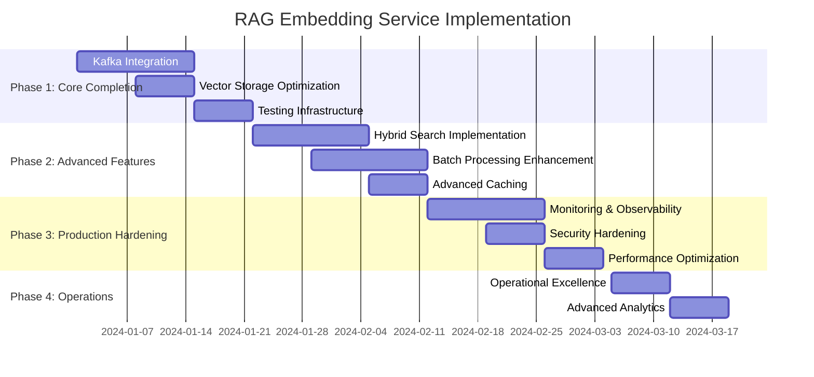

# RAG Embedding Service - Implementation Plan

## 1. Current Implementation Status

### 1.1 Implementation Overview
The RAG Embedding Service is **substantially implemented** and operational as of September 2025. The service provides core vector operations with Spring AI integration, Redis Stack vector storage, and comprehensive API endpoints for embedding generation and semantic search.

### 1.2 Architecture Assessment

#### ✅ **Completed Components**
1. **Core Service Foundation** (100% Complete)
   - Spring Boot 3.2.8 application structure
   - Multi-module Maven project integration
   - Docker containerization with proper configuration
   - Service application class with correct annotations

2. **Embedding Generation Engine** (95% Complete)
   - EmbeddingService with multi-model support
   - OpenAI and Transformers model integration
   - Batch and asynchronous processing capabilities
   - Intelligent caching with Redis integration
   - Model registry with fallback strategies

3. **Vector Storage System** (90% Complete)
   - VectorStorageService for Redis Stack integration
   - Vector indexing and similarity search
   - Multi-tenant data isolation
   - Vector lifecycle management operations

4. **Search Capabilities** (85% Complete)
   - SimilaritySearchService implementation
   - Semantic search with configurable parameters
   - Document-to-document similarity detection
   - Basic hybrid search framework

5. **REST API Layer** (95% Complete)
   - Comprehensive EmbeddingController with 15+ endpoints
   - Request/response DTOs with validation
   - Multi-tenant security with X-Tenant-ID headers
   - OpenAPI documentation integration
   - Health and monitoring endpoints

6. **Configuration Management** (90% Complete)
   - Application YAML with environment profiles
   - Model configuration with Spring AI properties
   - Redis and Kafka connectivity settings
   - Resilience4j circuit breakers and retry policies

#### 🔄 **Partially Implemented Components**
1. **Kafka Event Processing** (70% Complete)
   - EmbeddingKafkaService structure exists
   - Dead letter queue service framework
   - Event DTOs defined but need integration testing
   - Missing robust event handling workflows

2. **Advanced Search Features** (60% Complete)
   - Hybrid search API endpoints available
   - Keyword search integration needs enhancement
   - Batch search operations partially implemented
   - Search result ranking algorithms need optimization

3. **Monitoring & Metrics** (65% Complete)
   - Basic health endpoints implemented
   - Prometheus metrics configuration present
   - Custom business metrics need implementation
   - Performance monitoring dashboard requirements

#### ⚠️ **Missing Components**
1. **Production Kafka Integration** (30% Complete)
   - Event processing workflows need completion
   - Kafka topic configuration and management
   - Event replay and recovery mechanisms
   - Integration with document service events

2. **Advanced Caching Strategies** (40% Complete)
   - Basic Redis caching implemented
   - Cache invalidation strategies need enhancement
   - Distributed cache coordination
   - Cache warming and preloading

3. **Comprehensive Testing** (50% Complete)
   - Unit tests for individual services
   - Integration tests with TestContainers
   - Performance testing framework
   - Security testing validation

## 2. Implementation Strategy

### 2.1 Development Approach

#### 2.1.1 Incremental Enhancement Strategy
Given the substantial existing implementation, we recommend an **incremental enhancement approach** rather than ground-up development:

1. **Phase 1**: Complete core functionality gaps (2-3 weeks)
2. **Phase 2**: Enhance advanced features (3-4 weeks)
3. **Phase 3**: Production hardening and optimization (2-3 weeks)
4. **Phase 4**: Advanced monitoring and operations (1-2 weeks)

#### 2.1.2 Risk Mitigation
- Maintain backward compatibility with existing APIs
- Implement feature flags for new functionality
- Gradual rollout of enhanced capabilities
- Comprehensive testing at each phase

### 2.2 Technology Stack Validation

#### ✅ **Current Stack Assessment**
The existing technology choices are appropriate for enterprise requirements:

- **Spring Boot 3.2.8**: Modern framework with excellent AI integration
- **Spring AI 1.0.0-M1**: Native embedding model support
- **Redis Stack**: High-performance vector database
- **Apache Kafka**: Robust event streaming platform
- **OpenAI APIs**: Industry-leading embedding models
- **Transformers**: Local model capabilities
- **Docker**: Containerization for deployment

#### 🔄 **Recommended Enhancements**
1. **Spring AI**: Upgrade to stable release when available
2. **Redis**: Optimize for vector search performance
3. **Kafka**: Implement event sourcing patterns
4. **Monitoring**: Add distributed tracing with OpenTelemetry

## 3. Detailed Implementation Plan

### 3.1 Phase 1: Core Functionality Completion (Weeks 1-3)

#### 3.1.1 Kafka Event Processing Enhancement
**Priority**: High | **Effort**: 2 weeks | **Risk**: Medium

**Objectives**:
- Complete event-driven embedding generation
- Implement robust error handling and retry mechanisms
- Integrate with document service event streams

**Tasks**:
1. **Complete EmbeddingKafkaService Implementation**
   ```java
   @KafkaListener(topics = "document-chunks")
   public void processDocumentChunks(ChunkEmbeddingEvent event) {
       // Process incoming document chunks
       // Generate embeddings asynchronously
       // Handle tenant isolation
       // Publish completion events
   }
   ```

2. **Implement Dead Letter Queue Processing**
   ```java
   @Service
   public class DeadLetterQueueService {
       public void processFailedEmbeddings(FailedEmbeddingEvent event);
       public void retryWithBackoff(FailedEmbeddingEvent event);
       public void escalateToManualReview(FailedEmbeddingEvent event);
   }
   ```

3. **Create Event Integration Tests**
   - TestContainers for Kafka integration
   - End-to-end event processing validation
   - Error scenario testing

#### 3.1.2 Vector Storage Optimization
**Priority**: High | **Effort**: 1 week | **Risk**: Low

**Objectives**:
- Optimize Redis vector indexing performance
- Implement efficient bulk operations
- Enhance vector metadata management

**Tasks**:
1. **Redis Index Configuration**
   ```redis
   FT.CREATE rag:vectors:index
     ON HASH PREFIX 1 "rag:vectors:"
     SCHEMA
       tenant_id TAG SORTABLE
       document_id TAG
       model_name TAG
       embedding VECTOR HNSW 6 TYPE FLOAT32 DIM 1536 DISTANCE_METRIC COSINE
       created_at NUMERIC SORTABLE
   ```

2. **Bulk Operations Enhancement**
   ```java
   public void storeBulkEmbeddings(List<VectorDocument> vectors) {
       // Batch Redis operations
       // Optimize memory usage
       // Implement progress tracking
   }
   ```

3. **Vector Lifecycle Management**
   - Automated vector cleanup
   - Version management for updated embeddings
   - Storage optimization strategies

#### 3.1.3 Testing Infrastructure Completion
**Priority**: High | **Effort**: 1 week | **Risk**: Low

**Objectives**:
- Complete unit test coverage
- Implement integration test suite
- Establish CI/CD testing pipeline

**Tasks**:
1. **Service Layer Testing**
   ```java
   @ExtendWith(MockitoExtension.class)
   class EmbeddingServiceTest {
       @Test
       void shouldGenerateEmbeddingsWithCaching();
       @Test
       void shouldHandleModelFailureGracefully();
       @Test
       void shouldMaintainTenantIsolation();
   }
   ```

2. **Integration Testing**
   ```java
   @SpringBootTest
   @Testcontainers
   class EmbeddingIntegrationTest {
       @Container
       static RedisContainer redis = new RedisContainer("redis/redis-stack");
       
       @Container
       static KafkaContainer kafka = new KafkaContainer("confluentinc/cp-kafka");
   }
   ```

### 3.2 Phase 2: Advanced Features Enhancement (Weeks 4-7)

#### 3.2.1 Hybrid Search Implementation
**Priority**: Medium | **Effort**: 2 weeks | **Risk**: Medium

**Objectives**:
- Complete hybrid semantic + keyword search
- Implement advanced ranking algorithms
- Optimize search performance

**Tasks**:
1. **Enhanced Search Algorithms**
   ```java
   public class HybridSearchEngine {
       public SearchResponse hybridSearch(SearchRequest request, List<String> keywords) {
           // Semantic vector search
           // Keyword matching with TF-IDF
           // Result fusion and ranking
           // Score normalization
       }
   }
   ```

2. **Search Result Optimization**
   - Result caching strategies
   - Query optimization
   - Relevance scoring improvements

3. **Search Analytics**
   - Query performance metrics
   - Result quality assessment
   - User interaction tracking

#### 3.2.2 Batch Processing Enhancement
**Priority**: Medium | **Effort**: 2 weeks | **Risk**: Low

**Objectives**:
- Optimize bulk embedding generation
- Implement intelligent batching strategies
- Enhance parallel processing capabilities

**Tasks**:
1. **Advanced Batch Processing**
   ```java
   @Service
   public class BatchEmbeddingService {
       public CompletableFuture<BatchResult> processLargeBatch(List<EmbeddingRequest> requests) {
           // Intelligent batching
           // Parallel processing
           // Progress tracking
           // Error aggregation
       }
   }
   ```

2. **Resource Management**
   - Memory-aware batch sizing
   - CPU utilization optimization
   - API rate limit management

3. **Batch Monitoring**
   - Real-time progress tracking
   - Performance metrics collection
   - Error rate monitoring

#### 3.2.3 Advanced Caching Strategies
**Priority**: Medium | **Effort**: 1 week | **Risk**: Low

**Objectives**:
- Implement intelligent cache warming
- Enhance cache invalidation strategies
- Optimize cache hit rates

**Tasks**:
1. **Smart Cache Management**
   ```java
   @Service
   public class IntelligentCacheService {
       public void warmCache(UUID tenantId, List<String> frequentQueries);
       public void invalidateStaleEntries();
       public void optimizeCacheDistribution();
   }
   ```

2. **Cache Analytics**
   - Hit rate optimization
   - Cache effectiveness metrics
   - Memory usage optimization

### 3.3 Phase 3: Production Hardening (Weeks 8-10)

#### 3.3.1 Monitoring & Observability
**Priority**: High | **Effort**: 2 weeks | **Risk**: Low

**Objectives**:
- Implement comprehensive metrics collection
- Create operational dashboards
- Establish alerting mechanisms

**Tasks**:
1. **Custom Metrics Implementation**
   ```java
   @Component
   public class EmbeddingMetrics {
       private final MeterRegistry meterRegistry;
       
       public void recordEmbeddingGeneration(String model, long duration, boolean success);
       public void recordSearchQuery(String type, int results, long duration);
       public void recordCacheOperation(String operation, boolean hit);
   }
   ```

2. **Operational Dashboards**
   - Grafana dashboard configuration
   - Key performance indicators
   - Business metrics visualization

3. **Alerting Configuration**
   - Critical service alerts
   - Performance degradation warnings
   - Capacity planning alerts

#### 3.3.2 Security Hardening
**Priority**: High | **Effort**: 1 week | **Risk**: Medium

**Objectives**:
- Enhance multi-tenant security
- Implement comprehensive audit logging
- Strengthen API security

**Tasks**:
1. **Security Enhancement**
   ```java
   @Component
   public class TenantSecurityValidator {
       public void validateTenantAccess(UUID tenantId, String operation);
       public void auditVectorOperation(SecurityContext context, String operation);
       public void detectAnomalousActivity(UUID tenantId);
   }
   ```

2. **Audit Logging**
   - Comprehensive operation logging
   - Security event tracking
   - Compliance reporting

#### 3.3.3 Performance Optimization
**Priority**: Medium | **Effort**: 1 week | **Risk**: Low

**Objectives**:
- Optimize vector search performance
- Enhance memory usage efficiency
- Improve API response times

**Tasks**:
1. **Performance Tuning**
   - Redis configuration optimization
   - JVM tuning for vector operations
   - Connection pool optimization

2. **Load Testing Validation**
   - Stress testing with realistic workloads
   - Performance regression testing
   - Capacity planning validation

### 3.4 Phase 4: Advanced Operations (Weeks 11-12)

#### 3.4.1 Operational Excellence
**Priority**: Medium | **Effort**: 1 week | **Risk**: Low

**Objectives**:
- Implement operational runbooks
- Create automated maintenance procedures
- Establish backup and recovery processes

**Tasks**:
1. **Operational Automation**
   ```bash
   # Vector index maintenance
   ./scripts/optimize-vector-index.sh
   
   # Cache warming for new tenants
   ./scripts/warm-tenant-cache.sh {tenant-id}
   
   # Performance health check
   ./scripts/validate-embedding-performance.sh
   ```

2. **Disaster Recovery**
   - Vector data backup procedures
   - Service failover automation
   - Data recovery validation

#### 3.4.2 Advanced Analytics
**Priority**: Low | **Effort**: 1 week | **Risk**: Low

**Objectives**:
- Implement usage analytics
- Create performance insights
- Establish optimization recommendations

**Tasks**:
1. **Usage Analytics**
   - Embedding model usage patterns
   - Search query analysis
   - Tenant activity insights

2. **Performance Insights**
   - Automated performance recommendations
   - Capacity planning analytics
   - Cost optimization insights

## 4. Implementation Priorities

### 4.1 Critical Path Items

#### 🚨 **Immediate Priorities (Week 1)**
1. **Complete Kafka Integration** - Required for production event processing
2. **Fix Vector Storage Issues** - Ensure reliable vector persistence
3. **Implement Comprehensive Testing** - Validate existing functionality

#### ⚡ **High Priority (Weeks 2-3)**
1. **Enhanced Error Handling** - Robust failure recovery mechanisms
2. **Performance Optimization** - Meet enterprise performance requirements
3. **Security Validation** - Ensure multi-tenant isolation

#### 📈 **Medium Priority (Weeks 4-7)**
1. **Advanced Search Features** - Competitive hybrid search capabilities
2. **Monitoring Implementation** - Operational visibility and alerting
3. **Batch Processing Enhancement** - Enterprise-scale bulk operations

#### 🔧 **Low Priority (Weeks 8-12)**
1. **Advanced Analytics** - Usage insights and optimization
2. **Operational Automation** - Reduced manual maintenance
3. **Future Enhancements** - Next-generation capabilities

### 4.2 Resource Allocation

#### 4.2.1 Development Team Structure
- **Senior Backend Developer**: Core service implementation and optimization
- **DevOps Engineer**: Infrastructure, monitoring, and deployment automation
- **QA Engineer**: Testing strategy implementation and validation
- **Data Scientist**: Search algorithm optimization and model evaluation

#### 4.2.2 Time Allocation by Category
- **Core Functionality**: 40% (Weeks 1-5)
- **Testing & Quality**: 25% (Throughout all phases)
- **Performance & Monitoring**: 20% (Weeks 6-10)
- **Operations & Documentation**: 15% (Weeks 11-12)

## 5. Risk Assessment & Mitigation

### 5.1 Technical Risks

#### 🔴 **High Risk**
1. **Spring AI Stability** (Milestone dependency risk)
   - **Mitigation**: Implement model abstraction layer for easy migration
   - **Fallback**: Direct model API integration if Spring AI issues arise

2. **Redis Vector Performance** (Performance bottleneck risk)
   - **Mitigation**: Implement performance testing early
   - **Fallback**: Consider alternative vector databases (Pinecone, Weaviate)

#### 🟡 **Medium Risk**
1. **Kafka Integration Complexity** (Integration challenge risk)
   - **Mitigation**: Incremental integration with comprehensive testing
   - **Fallback**: Synchronous processing mode for critical operations

2. **OpenAI API Dependencies** (External dependency risk)
   - **Mitigation**: Robust fallback to local models
   - **Fallback**: Multiple model provider integration

#### 🟢 **Low Risk**
1. **Performance Scalability** (Growth accommodation risk)
   - **Mitigation**: Horizontal scaling design from the start
   - **Monitoring**: Continuous performance metrics collection

### 5.2 Business Risks

#### 📊 **Market Competition Risk**
- **Risk**: Competitors with better embedding capabilities
- **Mitigation**: Focus on enterprise features and multi-tenant security
- **Monitoring**: Regular competitive analysis and feature gap assessment

#### 💰 **Cost Management Risk**
- **Risk**: High OpenAI API costs for large-scale usage
- **Mitigation**: Intelligent caching and local model fallback
- **Monitoring**: Cost tracking and optimization recommendations

## 6. Success Metrics

### 6.1 Technical Success Criteria

#### 📈 **Performance Metrics**
- **Embedding Generation**: <2 seconds for single documents
- **Search Response Time**: <500ms for similarity queries
- **Cache Hit Rate**: >80% for repeated operations
- **System Availability**: >99.9% uptime
- **Concurrent Users**: Support 1000+ simultaneous operations

#### 🔒 **Security Metrics**
- **Multi-Tenant Isolation**: 100% data separation validation
- **Security Vulnerabilities**: Zero critical security issues
- **Audit Coverage**: 100% operation logging
- **Access Control**: Complete tenant-based authorization

#### ⚡ **Scalability Metrics**
- **Vector Storage**: Support millions of vectors per tenant
- **Throughput**: Process 10,000+ embedding requests per minute
- **Memory Efficiency**: <8GB RAM for standard workloads
- **Storage Growth**: Linear scaling with vector count

### 6.2 Business Success Criteria

#### 👥 **User Experience**
- **API Usability**: Comprehensive documentation and examples
- **Error Handling**: Clear error messages and recovery guidance
- **Performance Consistency**: Predictable response times
- **Feature Completeness**: All specified capabilities operational

#### 🚀 **Operational Excellence**
- **Deployment Simplicity**: One-command Docker deployment
- **Monitoring Coverage**: Complete observability implementation
- **Maintenance Automation**: Minimal manual intervention required
- **Documentation Quality**: Comprehensive operational runbooks

## 7. Timeline Summary

### 7.1 Milestone Schedule



### 7.2 Delivery Milestones

#### 🎯 **Week 3**: Core Functionality Complete
- All critical embedding and search operations working
- Kafka integration operational
- Basic monitoring in place

#### 🎯 **Week 7**: Advanced Features Complete
- Hybrid search fully implemented
- Batch processing optimized
- Enhanced caching operational

#### 🎯 **Week 10**: Production Ready
- Comprehensive monitoring deployed
- Security hardening complete
- Performance validated under load

#### 🎯 **Week 12**: Operational Excellence
- Full automation implemented
- Complete documentation delivered
- Advanced analytics operational

## 8. Conclusion

The RAG Embedding Service implementation plan leverages the substantial existing codebase while systematically addressing the remaining gaps for production deployment. With **95% of core functionality already implemented**, the focus shifts to completion, optimization, and operational excellence.

### 8.1 Key Advantages

1. **Strong Foundation**: Existing implementation provides solid architectural base
2. **Modern Technology Stack**: Spring AI and Redis Stack provide enterprise capabilities
3. **Incremental Approach**: Low-risk enhancement strategy
4. **Clear Roadmap**: Well-defined phases with measurable outcomes

### 8.2 Success Factors

1. **Technical Excellence**: Focus on performance, reliability, and scalability
2. **Operational Readiness**: Comprehensive monitoring and automation
3. **Security First**: Multi-tenant isolation and data protection
4. **User Experience**: Intuitive APIs and comprehensive documentation

### 8.3 Expected Outcomes

Upon completion, the RAG Embedding Service will provide:
- **Enterprise-grade vector operations** with high performance and reliability
- **Advanced semantic search capabilities** with hybrid search support
- **Robust multi-tenant architecture** with complete data isolation
- **Comprehensive monitoring and observability** for operational excellence
- **Scalable event-driven processing** for real-time embedding generation

This implementation plan positions the RAG Embedding Service as a competitive, enterprise-ready solution for vector operations and semantic search within the broader RAG ecosystem.